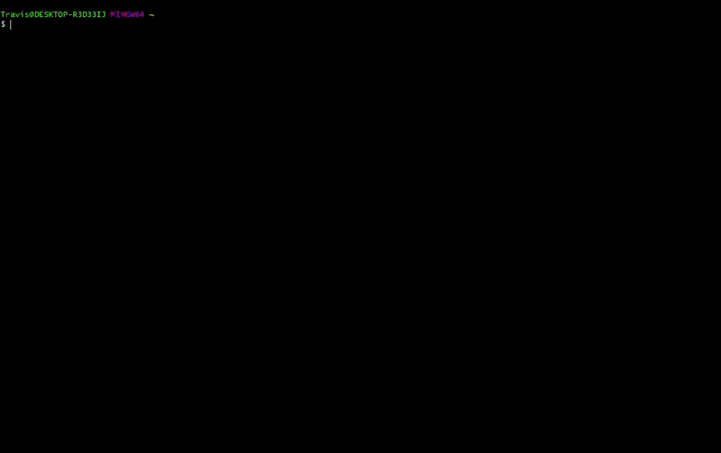

## Warming Up

In this module, we will:
* cover basic materials needed
* familiarize ourselves with remote computing
* prepare for later modules

 
 
 

 
 
 

## Local vs remote exercise:

1. Become familiar with the different appearance of the local shell
2. Create local folder `~/workshop_rsd` for results
3. Log in to the aws instance with `ssh <username>@50.17.210.255`
5. Become familiar with appearance of the remote shell

Click here for hints - Local vs remote exercise

1. Familiarize with local shell appearance
2. Create local folder for results

        mkdir ~/workshop_rsd

3. Log in to aws instance

        ssh <username>@50.17.210.255

4. Become familiar with the differences between local and remote shell

 
 
 

Click here for demonstration of local (git-bash on Windows) vs remote (AWS)

 
 
 

## Orientation exercise

Note: We will provide additional time during this exercise to ensure that everyone is prepared to move forward.

Orientation exercise:

1. Log in (or confirm logged in) to aws instance
2. Ensure in home directory with `cd`
3. Use `cp` to copy the data from `/rsd/data/` to your home directory
4. Use `ls` to view references
5. Use `ls` to view input fastq files
6. Use `mkdir` to create a folder for our analysis

Click here for solution

1. Ensure we're logged in to remote

        ssh <username>@50.17.210.255

2. Ensure we are in home directory

        cd

3. Copy data to our home directory

        cp -r /rsd/data/ ~/

4. View our references

        ls ~/data/refs

5. View our input fastq files

        ls ~/data/reads

6. Create a folder for our analysis

        mkdir ~/analysis

 
 
 

## Bonus exercise:

1. Ensure we're on
2. run the command `fortune | cowsay | lolcat`

Optional and only for fun!

These programs are installed 'games' for entertainment purposes.

Details about `fortune | cowsay | lolcat`

`fortune` prints a random fortune
`cowsay` is a talking cow
`lolcat` is like `cat` but with a fun twist

 
 
 
 
 
 

 
 
 
 
 
 
 
 
 
 
 
 
 
 
 
