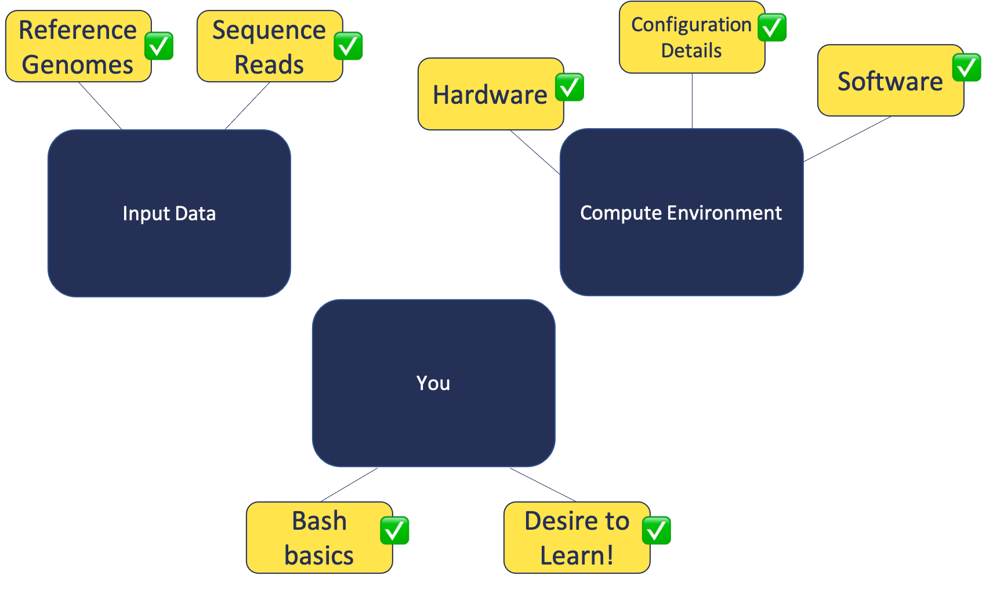

## Warming Up

In this module, we will:
* Discuss important aspects of

 
 
 

 
 
 

## Warm-up exercise:

1. Try logging into the AWS instance
2. run the command `fortune | cowsay | lolcat`

Optional and only for fun!
We will have time for troubleshooting at the next section.

 
 
 

## Local vs remote exercise:

1. Determine if you are currently viewing a remote or local shell
2. If remote, log out by using the command `exit`
3. Become familiar with the different appearance of the local shell
4. Create local folder for results
5. Log back in to the aws instance
6. Become familiar with the differences between the local and remote shell.

Click here for hints - Local vs remote exercise

1. Determine if you are in remote or local shell
2. If remote, log out

        # If remote
        exit

3. Familiarize with local shell appearance
4. Create local folder for results

        mkdir ~/workshop_rsd

 
 
 

## Orientation exercise

Note: We will provide additional time during this exercise for people who have had trouble logging in earlier.

Orientation exercise:

1. Ensure in home directory with `cd`
2. Copy the data from `/rsd/data/` to your home directory
3. Use `ls` to view references
4. Use `ls` to view input fastq files

Click here for help with the copy command

1. Ensure we're logged in to remote

You can use this command to copy the data into your home directory.

2. Ensure we are in home directory

        cd

3. Copy data to our home directory

Upon success, `ls ~/data/` will show:

4. View our references

        ls ~/data/refs

5. View our input fastq files

        ls ~/data/reads

6. Create a folder for our analysis

        mkdir ~/analysis

 
 
 
 
 
 

 
 
 
 
 
 
 
 
 
 
 
 
 
 
 
