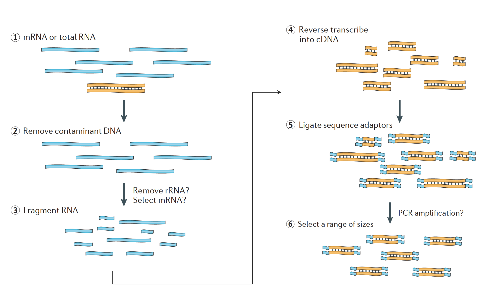

<!---
library(rmarkdown)
render('Module3a_Design_Prep_Seq.Rmd', output_dir = 'site')
--->

<!--- Allow the page to be wider --->

> # Objectives
> - Understand some applications of RNA-seq.
> - Introduce the overall differential expression workflow.
> - Understand experimental design concepts such as replicates and batch effects.
> - Understand different types of library preps, their requirements and uses.
> - Introduce how sequencing works.
> - Understand how to estimate how many reads are needed for an experiment.

# Transcriptomics

RNA-seq measures the transcriptome, the biological material in the cell arising from transcription. It has many uses:

- Differential gene expression: a *quantitative* evaluation and comparison of transcript levels between groups of samples
- Transcriptome assembly: a *qualitative* profile of transcribed regions of the genome
- Construct better gene models
- Metatranscriptomics or community transcriptome analysis

## Differential Expression Workflow

The remainder of the workshop is oriented around a standard bulk RNA-seq workflow with the goal of doing differential gene expression analysis between groups of samples. In this lesson, we will go over the bold parts of the workflow.

| Step | Task |
| :--: | ---- |
| **1** | **Experimental Design** |
| **2** | **Biological Samples / Library Preparation** |
| **3** | **Sequence Reads** |
| 4 | Assess Quality of Raw Reads |
| 5 | Splice-aware Mapping to Genome |
| 6 | Count Reads Associated with Genes |
| 7 | Test for DE Genes |

# Experimental Design and Practicalities

## Replicates

Replicates in biological experiments allow us to measure different sources of variability in the system. The two types of replicates are:

- **Technical replicate**: The biological material is the same, but the library preparation and sequencing are repeated. This measures variation in the library preparation or sequencing process.
- **Biological replicate**: Different biological material with the same library preparation and sequencing. This measures variation in the biological system.

Library preparation and sequencing technology have matured to the point where technical variation is so low that **technical replicates are unnecessary** in most cases.

On the other hand, **biological replicates are always necessary**. Without them, it is not possible to rigorously execute a differential expression analysis.

We recommend at least 2 biological replicates **always**, and more when budgets allow.

## Batch Effects

Batch effects are introduced when groups of samples are handled in distinct ways. This can take many forms:

- Processing case samples on Monday and control samples on Tuesday.
- Having one student process case samples and another process control samples.
- Running a group of samples on one type of sequencer and another group of samples on another.

In both of the cases above, since case and control also correspond to either day of library prep or person doing library prep, the primary variable of interest for the comparison is **confounded**, and we cannot know if a change is biological or because of the way the samples were handled.

It is easiest to treat all the samples the same, or if it is necessary to prepare samples in batches, randomize the samples with respect to the batch so you never confound comparisons of interest.

# Library Preparation

## Library Types

The [Univeristy of Michigan Advanced Genomics Core (AGC)](https://brcf.medicine.umich.edu/cores/advanced-genomics/) performs a variety bulk RNA-seq library preps. Different library preparations enable different research questions and have different costs.

| Preparation Type | RNA Measured | Recommended |
| ---------------- | ------------ | ----------- |
| polyA | mRNA | Typical for DE analysis. |
| Total RNA | mRNA and long-noncoding RNA | Interested in other RNA types. Organism lacks polyA, e.g. bacterial DNA|
| QuantSeq | mRNA | Cost-effective microarray replacement. Good for low RIN scores. |

Depending on the library type, AGC has [recommendations](https://brcf.medicine.umich.edu/cores/advanced-genomics/sample-requirements/) for starting amounts and quality. In general, they recommend >200ng for most assays, noting that "higher input yields better performing assays and more robust data."

## RNA Integrity Number

The RNA Integrity Number (RIN) is a tool developed by [Agilent](https://bmcmolbiol.biomedcentral.com/articles/10.1186/1471-2199-7-3) to measure RNA degredation in a systematic way. It is reported on a scale of 0 to 10, from very degraded to least degraded, and AGC runs each sample on the Bioanalyzer to obtain a RIN number. [Their recommendations](https://brcf.medicine.umich.edu/cores/advanced-genomics/sample-requirements/) for RIN scores vary by library type, but in general the higher the RIN score, the more robust your data.

[Romero et al](https://bmcbiol.biomedcentral.com/articles/10.1186/1741-7007-12-42) investigated the impact of low RIN scores on downstream analyses. They reported that degradation can reduce library complexity, which can lower alignment rates. They also reported that RNA degredation causes the variance between samples to increase, which will adversely affect differential expression modeling (as we will see on Day 2).

## Preparation

The figure below comprises the main steps of RNA-seq library preparation. To summarize: contaminant DNA is removed, selection for mRNA (polyA tails) or ribo-depletion occurs, RNA is fragmented, reverse transcribed into cDNA, sequence adapters (and possibly barcode indices for multiplexing) are ligated, and a range of fragment sizes are selected.

# Sequencing

## How Does It Work?

Briefly, during the library preparation step, binding oligos are added to the ends of the fragments which are complementary to a lawn of oligos on the flowcell. Each fragment is clonally amplified via bridge amplification to create clusters of the original fragments. The fragments are then sequenced by adding flourescently tagged nucleotides that are incorporated as the complement to the template. The sequencer detects these flashes of flourescence in the clusters across the entire flowcell, recording, in essence, the sequence of the fragments.

Illumina has an explanatory [video](https://www.youtube.com/watch?v=fCd6B5HRaZ8&feature=emb_title) about their Sequencing-by-Synthesis technology.

## How Many Reads?

For human samples, and a regular differential expression analysis, at least 30 million reads per sample are recommended in the [ENCODE guidelines](https://www.encodeproject.org/documents/cede0cbe-d324-4ce7-ace4-f0c3eddf5972/@@download/attachment/ENCODE%20Best%20Practices%20for%20RNA_v2.pdf). For other organisms, you can crudely scale by the size of the transcriptome. For other purposes, such as transcriptome assembly, you will need many more reads to attain sufficient coverage.

## Single or Paired End?

Many resources state that single-end sequencing is sufficient for differential expression analysis, and that paired-end reads may be an unnecessary expense. However, economies of scale at AGC can make a paired-end 150 bp sequencing run more cost effective than it used to be. Additionally, paired-end reads typically result in better alignments because of the additional information. If an isoform-level analysis is of interest, paired-end reads are much better.

The [AGC Cost Estimator](https://agc-estimator.brcf.med.umich.edu/) is a useful tool for determining libary preparation and sequencing costs for various RNA-seq experiments. Note, that when selecting a shared NovaSeq flowcell, the run will be 150PE.

## Additional Sources

- [2-BitBio Blog](https://2-bitbio.com/2017/04/rin-value-how-low-is-too-low.html)

---

These materials have been adapted and extended from materials created by the [Harvard Chan Bioinformatics Core (HBC)](http://bioinformatics.sph.harvard.edu/). These are open access materials distributed under the terms of the [Creative Commons Attribution license (CC BY 4.0)](http://creativecommons.org/licenses/by/4.0/), which permits unrestricted use, distribution, and reproduction in any medium, provided the original author and source are credited.
