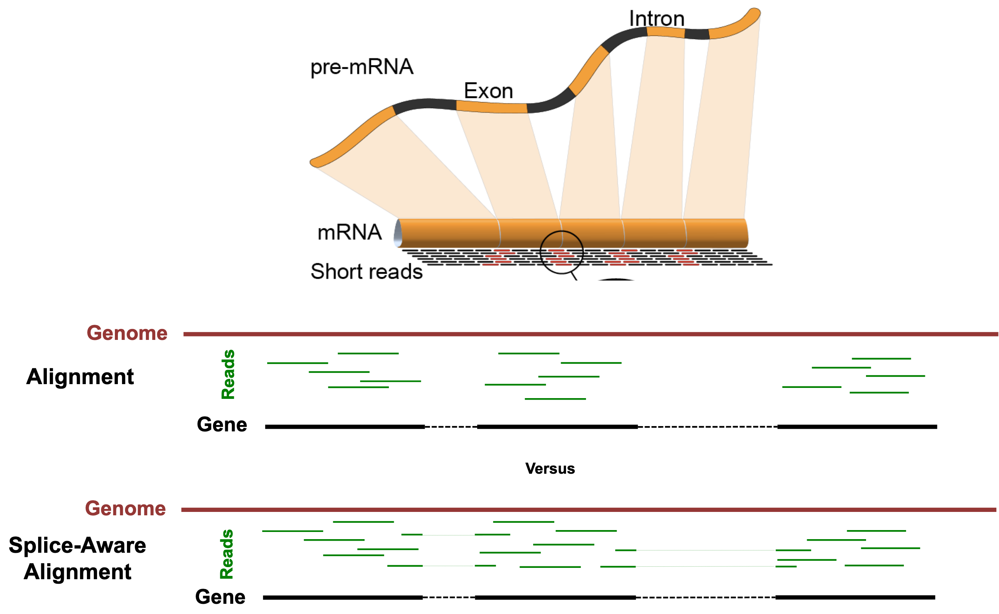

# Alignment

In this module, we will learn:
* the concept of splice-aware alignments
* the two steps needed to run RSEM+STAR
* details of SAM and BAM files, and RSEM outputs

# Differential Expression Workflow

We'll discuss the alignment and gene quantification steps which gather the necessary data that we will need prior to testing for differential expression, the topic of Day 2.

| Step | Task |
| :--: | ---- |
| 1 | Experimental Design |
| 2 | Biological Samples / Library Preparation |
| 3 | Sequence Reads |
| 4 | Assess Quality of Raw Reads |
| **5** | **Splice-aware Mapping to Genome** |
| **6** | **Count Reads Associated with Genes** |
| 7 | Test for DE Genes |

# Alignment and Gene Quantification

The FASTQ files of raw sequenced reads are untethered from any notion of where they came from in the genome, and which transcribed genes the sequence belongs to. The alignment and gene quantification steps fill in that gap and allow us to proceed with the question we are really interested in: Which genes are differentially expressed between groups of samples?

We will use RSEM ([paper](https://bmcbioinformatics.biomedcentral.com/articles/10.1186/1471-2105-12-323) and [GitHub](https://github.com/deweylab/RSEM)) combined with STAR Aligner ([paper](https://academic.oup.com/bioinformatics/article/29/1/15/272537) and [GitHub](https://github.com/alexdobin/STAR)) to accomplish the task of read mapping and gene quantifcation simultaneously.

## STAR

The "Spliced Transcripts Alignment to a Reference" (STAR) Aligner is aware of splice-sites of transcripts and is able to align reads that span them. The figure below illustrates the difference between splice-unaware aligners (e.g. Bowtie2) and splice-aware aligners (e.g. STAR).

Some benefits of splice-aware aligners include:

* Fewer reads are discarded for lack of alignments, leading to more accurate gene quantification.
* Direct evidence of isoform usage is possible.

We should note that the default parameters for STAR are optimized for **mammalian genomes**.

Credit: https://raw.githubusercontent.com/hbctraining/Intro-to-rnaseq-hpc-O2/master/lectures/Sequence_alignment.pdf

## RSEM

RSEM (RNA-seq by Expectation Maximization) determines gene and isoform abundance using an expectation maximization (EM) algorithm to determine the probability that any particular read originated from a particular transcript. From there, gene-level quantification is reported by effectively collapsing the isoform quantifications over all isoforms belonging to the gene.

The primary issue that RSEM attempts to solve is that reads can align to multiple isoforms (when, for example, they share an exon), and that creates ambiguity in deciding which isoform a read gets assigned to for quantification. See the image below for an illustration of this problem.

# Running RSEM+STAR

RSEM can be run with just two commands: the first `rsem-prepare-reference` ([manual](https://deweylab.github.io/RSEM/rsem-prepare-reference.html)) builds an index for STAR and RSEM to use, and the second `rsem-calculate-expression` ([manual](https://deweylab.github.io/RSEM/rsem-calculate-expression.html)) does the alignment and gene quantification.

## `rsem-prepare-reference`

 A reference index is essentially a lookup table that speeds up the finding of sequence matches for alignment. In the case of a splice-aware aligner, the reference index is also aware of the various splice junctions at locations in the gene model, and a subset of reads will map across these. This allows us to infer isoform usage later on.

 RSEM Prepare Reference Exercise:

 1. View the help page for rsem-prepare-reference
 2. Create and execute a command that will index our example genome
 3. Examine the output of the rsem

The result of `rsem-prepare-reference` is a folder containing files for RSEM and STAR to be able to look up genomic location and gene model information as quickly and efficiently as possible.

## `rsem-calculate-expression`

After preparing the reference index, we can do alignment and quantification with the `rsem-calculate-expression` ([manual](https://deweylab.github.io/RSEM/rsem-calculate-expression.html)) command. For our inputs, we will be using our FASTQ reads and the path to the reference index we just created.

RSEM Calculate Expression Exercise:

1. View the help page for rsem-calculate-expression
2. Create a command to execute RSEM / STAR alignment and quantification for one of our samples

RSEM+STAR, after completing above, outputs the following files for our sample:

| File | Description |
| ---- | ----------- |
| `sample_N.genome.bam` | The alignments in genomic coordinates. Used for visualization in a gennome browser such as [IGV](https://software.broadinstitute.org/software/igv/). |
| `sample_N.transcript.bam` | The alignments in transcriptomic coordinates. Not used for this workshop. |
| `sample_N.genes.results` | Gene-level results to be used in downstream DE analysis. |
| `sample_N.isoforms.results` | Isoform-level results. Not used for this workshop. |

# Output of RSEM+STAR

The two results we will use most often from RSEM+STAR are the gene-level quantifications (`sample_N.genes.results`) and the alignments in genome-coordinates (`sample_N.genome.bam`). Each sample for which we run RSEM+STAR will have these output files named after the sample.

## Genome Alignments

The `sample_N.genome.bam` alignments file is a special, compressed, version of a SAM file (sequence alignment/map). In order to view it, we have to use a special program called [`samtools`](https://www.htslib.org/doc/samtools.html).

If we were too peek inside of `sample_N.genome.bam`, we would see:

    $ samtools view ~/workshop_data/rsem_star/sample_N.genome.bam | head -2
    NB551521:212:H5L73AFX2:1:11101:16446:1034       0       2       10022660        255     148M    *       0       0       GANAGACAGATATCCTACAAAACACAGAAAGACTAATAAACTCTTATGTTGACTATGAAAGCTGTAAGAAACTTCCAGAAGAAATATTGAAAATGTAGAATAACTGAAGTGTGCTGTGTGTCCATAGCTGTTCTGCTGAGGAAACATT   AA#EEEEEEEEEEEEEEEEEEEEEEEEEEEEEEEEEEEEEEEEEEEEEEEEEEEEEEEEEEEEEEEEEEEEEEEEAEEEEEEEEEEEEEEEEEEEEEEEEEEEEEEEEEEEEEAEEEEEEEE<EEEEAEAEEAEA<A<AAAAEEEEEA    NH:i:1  HI:i:1  AS:i:145        NM:i:1  MD:Z:2A145
    NB551521:212:H5L73AFX2:1:11101:16366:1035       0       X       48488697        255     146M    *       0       0       TANGTACGCACACAAATTGATCCATACCTTTACTTCCTTTTTTTCCAGCTACTGAATAAGGGGACCTTTCTATTCCTTTGTGTCTCACCATTTTATTGTCTTTCAGAATCTTCACCTGGTCCATTCATTCCTCTACCCTCTCCTGT     AA#EEEEEEEEEEEEEEEEEEEEEEAEEEEEEEEEEEEEEEEEEE<EEEEEEEEEEEEEEEEEEEEEEEEEEEEEEEEEEEEEEEEEEEEEEE6EEEAEEEEEEEEEEEEEEEEEAEEEEEEEAAEEEE/<E<AA<<<AAAA<AEE      NH:i:1  HI:i:1  AS:i:143        NM:i:1  MD:Z:2G143

The [SAM format](https://en.wikipedia.org/wiki/SAM_(file_format)) gives information about where each read maps to in the genome (one read per line), and has information about that mapping.

## Gene-level Quantification

If we were to look at the top 3 lines of `sample_N.genes.results`, we see it is a plain-text file separated by tabs where each row is a gene, and the columns are described the first row.

    $ head -3 ~/workshop_data/rsem_star/sample_N.genes.results
    gene_id                 transcript_id(s)                        length  effective_length        expected_count  TPM     FPKM
    ENSMUSG00000000001      ENSMUST00000000001                      3262.00 3116.28                 601.00          45.50   36.70
    ENSMUSG00000000003      ENSMUST00000000003,ENSMUST00000114041   799.50  653.78                  0.00            0.00    0.00

| Column | Description |
| ---- | ----------- |
| gene_id | The ID from the gene model GTF. |
| transcript_id(s) | The transcript IDs corresponding to the gene in the gene model GTF. |
| length | The weighted average of its transcripts' lengths. |
| effective_length | The weighted average, over its transcripts, of the mean number of positions from which a fragment may start within the sequence of transcript. |
| expected_count | The sum, over all transcripts, of the estimated counts from the EM algorithm. |
| TPM | Transcript per million, a relative measure of transcript abundance where the sum of all TPMs is 1 million. |
| FPKM | Fragments per kilobase of transcript per million mapped reads. |

Now that we know how to run RSEM+STAR for one sample, we can repeat this for all samples.

Aligning All Samples Exercise:

1. Use RSEM+STAR command above, along with knowledge of bash for-loops, to construct a command that will run `rsem-calculate-expression` on each of our samples.
2. View the output, and verify that we have the files we need.

The `genes.results` files for each sample can be directly imported into DESeq2 using the [`tximport`](https://bioconductor.org/packages/release/bioc/vignettes/tximport/inst/doc/tximport.html#rsem) R Bioconductor package.

Alternatively, we can combine these results into a count matrix. We'll cover this in the next module.

---

These materials have been adapted and extended from materials created by the [Harvard Chan Bioinformatics Core (HBC)](http://bioinformatics.sph.harvard.edu/). These are open access materials distributed under the terms of the [Creative Commons Attribution license (CC BY 4.0)](http://creativecommons.org/licenses/by/4.0/), which permits unrestricted use, distribution, and reproduction in any medium, provided the original author and source are credited.
