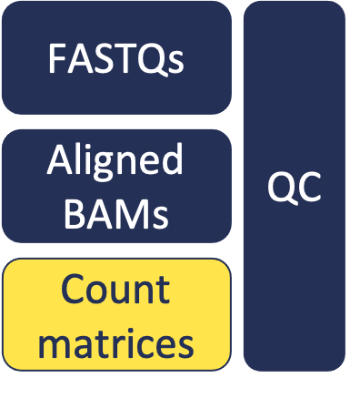

# Additional Information

In this module, we will discuss more details of:
* Input Data
* Compute Environment

# Input Data

## FASTQs

These files contain base sequence and quality information - usually provided by the sequencing provider.

You'll generally have one or two FASTQ files for each sample, depending on if your reads are single-end or paired-end. If there are more than two FASTQ files per sample, then it may be useful to combine them.

For paired-end data, make sure to combine read 1 FASTQs separately from read 2 FASTQs.

## References

Files with known data (e.g. from a model organism). These include reference genome sequence, and transcript annotation information, etc.

Reference files we'll use:

- Genome Fasta (ENSEMBL)
- Genome Annotation GTF (ENSEMBL)

More details in later modules.

# The Compute Environment

Here we're referring to all of the hardware, software, and configuration details of the system where we perform our analysis.

## Hardware

- CPU
- Memory
- Storage

### CPU

CPU stands for Central Processing Unit. In shorthand, people often refer to "the processor" of a device. This is the hardware that retrieves and executes instructions, and is one of the core components of a computing system.

Single vs Multi-Threaded

Many of the most heavily-used bioinformatics software can use multiple threads. By doing this, they can take advantage of parallel processing, which can drastically cut down processing speeds to receive results.

There are also plenty of single-threaded bioinformatics programs. Simple python scripts, niche tools, etc. will often not need parallel processing. In these cases, the cost/benefit tradeoff may be too great.

Multi-threaded programs we will use:

- Cutadapt
- STAR / RSEM

Single-threaded programs we'll use:

- FastQC
- MultiQC

What about clock speed?

You may be familiar with clock speed of a processor from your experience while buying personal computers. You may've seen specs listed such as `3.3 GHz`, which refers to the CPU's clock speed.

Clock speeds on all modern processors are sufficient for basically all bioinformatics software. Clock speed is generally not a major consideration in choices today.

### Memory

Here we're referring to Random Access Memory, or RAM. RAM is the hardware that provides a limited amount of very fast storage that a computer process will use within a short time frame.

The memory requirements of various tools vary widely, and many bioinformatics programs require fairly high amounts. This is true for aligners. In the case of the aligner we'll be using - STAR - a very large data structure is loaded into RAM. This allows extremely fast and accurate alignments e.g. to a vertebrate genome, but requires very large amounts of RAM.

Cutadapt, fastQC, and multiQC have more modest memory requirements, so we won't have to consider memory as much in those cases.

### Storage

Here we're referring to disk storage, or persistent storage. This is the hardware that stores large amounts of data persistently - the information will remain even when there is no power to the device. You may sometimes use the phrase "save [the file] to your hard drive", which is referring to persistent storage.

Consider:

- Storage for input files, output files
- Storage during processing

Some input and output files can be quite large. Additionally, several large intermediates are produced during processing, requiring (sometimes considerable) additional storage.

## System Configuration

### Operating System

The Operating System (OS) is the software layer that handles communication between the hardware devices and with the end user.

Examples:

- Microsoft - [Windows](https://en.wikipedia.org/wiki/Microsoft_Windows)
- Apple - [MacOS](https://en.wikipedia.org/wiki/MacOS)
- [FOSS](https://en.wikipedia.org/wiki/Free_and_open-source_software) - [GNU](http://www.gnu.org) / [LINUX](https://en.wikipedia.org/wiki/Linux)
- Google - [Android](https://en.wikipedia.org/wiki/Android_(operating_system))
- Apple - [iOS](https://en.wikipedia.org/wiki/IOS)

Some software is specific to an operating system - developers may focus their time and attention on developing for certain configurations over others, depending on the niche or goal. Often, releases may be limited to certain OS / hardware configurations.

### Local vs Remote

Can you touch the machine that is performing your computation? Can you hear the fan speed pick up when you begin your processes? This is local computing - probably what you're most familiar with.

On the other hand, with remote computing you will utilize a network connection to connect to a distant machine that performs the work. Remote computing is sensible in many situations - for economies of scale it's best to have many machines in physical locations that are built and designed for that purpose. This is what it means if you've heard of cloud computing - a type of remote computing, often with convenience services or products built on top of the remote machines.

### Job Management

This is a broad topic - job scheduling is a common method for allocating shared computing resources, but here we'll just consider a job as an individual call to a piece of software. There are many ways to manage resources at the job level.

Resource management and job scheduling at the UMich HPC is handled by SLURM. Quite a large topic of its own, you can read more about these resources [here](https://arc.umich.edu/greatlakes/slurm-user-guide/).

Another large topic which we won't dive into, are workflow managers. [Snakemake](https://snakemake.readthedocs.io/en/stable/) is an example of this.

Today we've been aiming for simplicity and transparency, so managed our jobs manually and sequentially. In other words, we wrote and submitted the commands by hand, in order, for illustrative purposes.

### Software Management

Similarly, there are many methods for managing software. As a system accumulates changes over time, and as the resulting software installations become more complex (esp. across multi-user systems), the need for software management systems becomes more apparent.

Today we've been using [miniconda](https://docs.conda.io/en/latest/miniconda.html). This provides a good balance of simplicity, flexibility, and utility for software management.

Conda is an open-source, cross-platform, package management and environment management software. It's widely used for packaging and distributing software, particularly in the python community. Note: it is also used for software of many different software languages; it is language-agnostic.

Miniconda is a minimal installation of conda, that provides a lightweight option to get started with.

## Software

The software we've been using is free, open-source, and openly licensed. We can inspect the source code, use the program as we wish, modify it, contribute to it, etc. This is the case for many bioinformatics tools. We can appreciate the benefits of community-driven software.

There are tools available for various kinds of bioinformatics tasks. Today we've focused on a few important tasks for RNA sequencing, and used a subset of quality tools for this purpose. Here is a summary of the tasks we've performed and the tools we've used today.

| Task | Tool |
| :--: | ---- |
| Quality Control | [FastQC](https://www.bioinformatics.babraham.ac.uk/projects/fastqc/Help/) |
| Quality Control | [MultiQC](https://multiqc.info/docs/) |
| Read Trimming | [Cutadapt](https://cutadapt.readthedocs.io/en/stable/) |
| Alignment | [STAR](https://github.com/alexdobin/STAR/blob/master/doc/STARmanual.pdf) |
| Gene Quantification | [RSEM](http://deweylab.github.io/RSEM/) |

 
 
 
 
 

# Summary

Things that we have learned:
* Important aspects of hardware, software, and compute environments to consider
* Important file formats and their contents
* Reference files necessary / where to find
* How to use FastQC, assess quality of reads
* How to transfer files from remote to local computer
* How to prepare a reference for alignment and quantification with RSEM + STAR
* How to combine expression results across samples into a count matrix
* How to use MultiQC to summarize large volumes of QC data.

