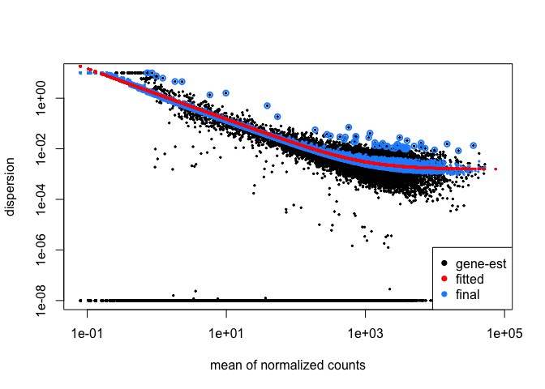

<!--- Allow the page to be wider --->
<style>
    body .main-container {
        max-width: 1200px;
    }
</style>
> # Objectives 
> * Generate tables of DE results
> * Understand what a p-value represents.   
> * Understand  multiple hypothesis correction and importance    


# Generating DE results

Now that we have reviewed the plots by sample and determined that our data passed our quality control checks, specifically that the patterns we observe are likely due to our experimental treatments over technical or other cofounding factors. 

This illustration from the HCB training materials illustrates the basis of the differential expression procedure, where our goal is to compare the distribution of an expressed gene across samples in each treatment groups. 

*Image credit: Paul Pavlidis, UBC*

Only where the distributions of each group are sufficiently seperated will a gene be considered differentially expressed. This is where having sufficient replicates to overcome within group variance is important, as the more replicates we have in each group the better we can determine the distributions of expression for each group. 

## Dispersion estimates

Since we've already run our `DESeq` analysis, the internal normalization process and specified model fit have already been added to our `dds` object. Let's take another look at the `dds` object.


```r
head(dds)
```

We can visualize the DESeq2 normalization results for our data, which center on shrinking the variance across all genes to better fit the expected spread at a given expression level by plotting the **dispersion estimates** with the `plotDispEsts` function.


```r
plotDispEsts(dds)
```

<!-- -->

We can see the raw data plotted in black, the fitted (or expected) dispersion in red, and the normalized data with scaled variance in blue. Since we have fairly small sample sizes for each condition, we see shrinkage for many genes but a reasonable correlation between the expression level and dispersions.

This [HBC tutorial](https://hbctraining.github.io/DGE_workshop/lessons/04_DGE_DESeq2_analysis.html) has a more detailed overview of estimating size factors, estimating gene dispersion, and the shrinkage procedure, as well as examples of concerning dispersion plots that may suggest reassessing quality of the experimental data. 

## DESeq2 statistical testing

We have already fit our DESeq2 model, specifing our model as `~ condition` and our next step is to identify genes with significantly different expression between our contrasts of interest. To determine significance, a statistical test is required.

The first step for any statistical test is to define the *null hypothesis*. In this case, the null hypothesis would be that there is no difference in the expression of a gene between two groups of samples, such as illustrated at the bottom of the first figure in this module. The next step is to use a statistical test to determine if, based on the observed data, the null hypothesis can be rejected.

To do this, [DESeq2 applies the Wald test](http://bioconductor.org/packages/devel/bioc/vignettes/DESeq2/inst/doc/DESeq2.html#theory-behind-deseq2) to compare two groups. A Wald test statistic is computed as well as the probability that the observed value or more extreme test statistic would be observed. This probability is called the p-value of the test. If the p-value is smaller than a pre-defined threshold, we would reject the null hypothesis and state that there is evidence against the null, i.e. the gene is differentially expressed. However, if the p-value is larger than our threshold, we would *fail to reject* the null hypothesis, meaning that we lack evidence that the expression of this gene is different *NOT* that we have evidence that the expression is indeed the same in both groups. 

For a more detailed overview of the statistical comparisons , please refer to [this HBC tutorial](https://hbctraining.github.io/DGE_workshop/lessons/05_DGE_DESeq2_analysis2.html) or the [DESeq2 vignette](http://bioconductor.org/packages/devel/bioc/vignettes/DESeq2/inst/doc/DESeq2.html#theory-behind-deseq2).

## Results function

We can check what comparisons were automatically generated during fitting using the `resultsNames()`. 

```r
resultsNames(dds)
```

```
## [1] "Intercept"                 "condition_Mov.KD_vs_Irrel"
## [3] "condition_Mov.OE_vs_Irrel"
```

Since we are interested in comparing the Mov.KD or Mov.OE samples to the Irrel control, we can select one of the automatically generated comparisons using the `results` function and assign those result to a new object.

```r
Comparison <- "condition_Mov.KD_vs_Irrel"
res.KD <- results(dds, name=Comparison)
```

## How to generate additional contrasts

If there are comparisons that are not included in the `resultsName`, since our dds object already has the fitted data we can generate Wald test results by specifying those comparisons as an additional arguement to the results function. 

```r
?results
```

As the function description specifies, we need to provide a list of three elements: the name of the factor in the model design , the name of the numerator for the fold-change, and the name of denominator. 

```r
res <- results(dds, contrast=c("condition", "Mov.OE", "Mov.KD")) 
head(res)
```

```
## log2 fold change (MLE): condition Mov.OE vs Mov.KD 
## Wald test p-value: condition Mov.OE vs Mov.KD 
## DataFrame with 6 rows and 6 columns
##                      baseMean      log2FoldChange             lfcSE
##                     <numeric>           <numeric>         <numeric>
## 1/2-SBSRNA4  45.6520398838297   0.419683191255473 0.290719400573447
## A1BG         61.0931017446029   0.734289833638655 0.255553595010878
## A1BG-AS1     175.665806942797 -0.0219048636492748 0.151421337965442
## A1CF        0.237691930820274  -0.394640345451742  3.90552615816705
## A2LD1        89.6179845194553   0.199791060577194 0.210860385382295
## A2M          5.86008405881564   -1.37053355004315 0.830223419265839
##                           stat              pvalue               padj
##                      <numeric>           <numeric>          <numeric>
## 1/2-SBSRNA4   1.44360228601064   0.148850881528329  0.244113949038354
## A1BG          2.87333008798956 0.00406169494329787 0.0114152822809498
## A1BG-AS1    -0.144661670168797   0.884978003520527  0.923970738417963
## A1CF        -0.101046652734994   0.919513426142602                 NA
## A2LD1        0.947504009418213   0.343382014152301  0.470448243502285
## A2M          -1.65080087870215  0.0987792406661348  0.175676155442137
```

## Results table - review of output columns

Next, we'll take a look at the results we generated. 

```r
head(res.KD)
```

```
## log2 fold change (MLE): condition Mov.KD vs Irrel 
## Wald test p-value: condition Mov.KD vs Irrel 
## DataFrame with 6 rows and 6 columns
##                      baseMean      log2FoldChange             lfcSE
##                     <numeric>           <numeric>         <numeric>
## 1/2-SBSRNA4  45.6520398838297 -0.0459530807444898 0.298307965636635
## A1BG         61.0931017446029  -0.469530593375707 0.259973984103871
## A1BG-AS1     175.665806942797 -0.0357171311913219 0.151235151933608
## A1CF        0.237691930820274    1.31531242043588  3.90547731807847
## A2LD1        89.6179845194553   0.219941504648199 0.216902927866408
## A2M          5.86008405881564    0.10499012658481 0.745521271630633
##                           stat             pvalue              padj
##                      <numeric>          <numeric>         <numeric>
## 1/2-SBSRNA4 -0.154045771611961  0.877573645751931 0.930901554035368
## A1BG         -1.80606761478144 0.0709077786913598 0.162553231481329
## A1BG-AS1    -0.236169506458404  0.813301140607643 0.892144780094637
## A1CF         0.336786598234048  0.736277776558432                NA
## A2LD1         1.01400892469125  0.310578493747205 0.478401345505831
## A2M          0.140827808112264  0.888005974289951 0.937410246982998
```

We can see in the results table that the row name are gene symbols and there are [six columns of values](https://support.illumina.com/help/BS_App_RNASeq_DE_OLH_1000000071939/Content/Source/Informatics/Apps/DESeq2ResultFile_swBS.htm#:~:text=baseMean%E2%80%94The%20average%20of%20the,factors%2C%20taken%20over%20all%20samples.&text=log2FoldChange%E2%80%93The%20effect%20size%20estimate,the%20comparison%20and%20control%20groups). 

The first column, 'baseMean' is the average of the normalized count values, dividing by size factors, taken over all samples, and can be interpreted as the relative expression level of that gene across all samples. 

The second column, 'log2FoldChange', is the ratio of the expression of the numerator group (`Mov.KD`) over the denominator group (`Irrel`). If the value is positive, that means the expression of that gene is greater across the Mov.KD samples than across the Irrel samples. If the value is negative, that means the expression of that gene is greater across the Irrel samples. The third column, 'lfcSE' is the standard error for the log2 fold change estimate. 

The fourth column, 'stat', is the calculated Wald statistic for that gene, while the fifth column 'pvalue' is the *nominal* significance for that gene.

### Multiple hypothesis testing and FDR correction

The sixth column, 'padj', is the *adjusted p-value* and is what we use for determining significantly differently expressed genes. Why do we use values from this column instead of the 'pvalue' column?

Each p-value is the result of a single test for a single gene. The more genes we test, the greater chance we have of seeing a significant results. This is the multiple testing problem. If we used the p-value directly from the Wald test with a significance cut-off of p < 0.05, that means there is a 5% chance it is a false positives. So if we are testing 20,000 genes for differential expression, we would expect to see ~1,000 significant genes just by chance. This is problematic because we would need to sift through our “significant” genes to identify which ones are true positives.

DESeq2 reduces the number of genes that will be tested by removing genes with low number of counts and outlier samples (gene-level QC, see note below). However, we need to correct for [multiple hypothesis testing](https://multithreaded.stitchfix.com/blog/2015/10/15/multiple-hypothesis-testing/) to reduce the number of false positives, and while there are a few common approaches, the default method is False Discovery Rate(FDR)/Benjamini-Hochberg correction which is symbolized as 'BH' in DESeq2. [Benjamini and Hochberg (1995)](https://rss.onlinelibrary.wiley.com/doi/10.1111/j.2517-6161.1995.tb02031.x) defined the concept of FDR and created an algorithm to control it below a specified level. An interpretation of the BH method is implemented in DESeq2 in which genes are ranked by p-value, then each ranked p-value is multiplied by the number of total tests divided by rank.

> **Note**: From the `results` function help page and [HBC tutorial that includes overview of multiple hypothesis correction](https://hbctraining.github.io/DGE_workshop/lessons/05_DGE_DESeq2_analysis2.html), we can change the multiple hypothesis correction method to an alternative option using the `pAdjustMethod =` argument.

The default FDR rate cutoff for DESeq2 is `alpha = 0.05`. By setting the cutoff to < 0.05, we expect that the proportion of false positives amongst our differentially expressed genes is now controlled to 5%. For example, if we call 500 genes as differentially expressed with this FDR cutoff, we expect only 25 of them to be false positives. DESeq2 vignette's includes a [further discussion of filtering and multiple testing](http://bioconductor.org/packages/devel/bioc/vignettes/DESeq2/inst/doc/DESeq2.html#independent-filtering-and-multiple-testing)

> **Note on 'padj' values set to NA**
> As discussed in the [HBC tutorial](https://hbctraining.github.io/DGE_workshop/lessons/05_DGE_DESeq2_analysis2.html) as well as the [DESeq2 vignette](http://bioconductor.org/packages/devel/bioc/vignettes/DESeq2/inst/doc/DESeq2.html#i-want-to-benchmark-deseq2-comparing-to-other-de-tools.)
> * If within a row, all samples have zero counts, the baseMean column will be zero, and the log2 fold change estimates, p-value and adjusted p-value will all be set to NA.    
> * If a row contains a sample with an extreme count outlier then the p-value and adjusted p-value will be set to NA. These outlier counts are detected by Cook’s distance.     
> * If a row is filtered by automatic independent filtering, for having a low mean normalized count, then only the adjusted p-value will be set to NA.    

---

# Sources Used    
* HBC DGE training module, part 1: https://hbctraining.github.io/DGE_workshop/lessons/04_DGE_DESeq2_analysis.html    
* HBC DGE training module, part 2: https://hbctraining.github.io/DGE_workshop/lessons/05_DGE_DESeq2_analysis2.html    
* DESeq2 vignette: http://bioconductor.org/packages/devel/bioc/vignettes/DESeq2/inst/doc/DESeq2.html#differential-expression-analysis    

---


---

# Session Info

```r
sessionInfo()
```

```
## R version 3.6.1 (2019-07-05)
## Platform: x86_64-apple-darwin15.6.0 (64-bit)
## Running under: macOS Mojave 10.14.6
## 
## Matrix products: default
## BLAS:   /Library/Frameworks/R.framework/Versions/3.6/Resources/lib/libRblas.0.dylib
## LAPACK: /Library/Frameworks/R.framework/Versions/3.6/Resources/lib/libRlapack.dylib
## 
## locale:
## [1] en_US.UTF-8/en_US.UTF-8/en_US.UTF-8/C/en_US.UTF-8/en_US.UTF-8
## 
## attached base packages:
## [1] parallel  stats4    stats     graphics  grDevices utils     datasets 
## [8] methods   base     
## 
## other attached packages:
##  [1] dplyr_1.0.2                 tidyr_1.1.2                
##  [3] DESeq2_1.26.0               SummarizedExperiment_1.16.1
##  [5] DelayedArray_0.12.3         BiocParallel_1.20.1        
##  [7] matrixStats_0.57.0          Biobase_2.46.0             
##  [9] GenomicRanges_1.38.0        GenomeInfoDb_1.22.1        
## [11] IRanges_2.20.2              S4Vectors_0.24.4           
## [13] BiocGenerics_0.32.0        
## 
## loaded via a namespace (and not attached):
##  [1] bit64_4.0.5            splines_3.6.1          Formula_1.2-3         
##  [4] latticeExtra_0.6-29    blob_1.2.1             GenomeInfoDbData_1.2.2
##  [7] yaml_2.2.1             pillar_1.4.6           RSQLite_2.2.1         
## [10] backports_1.1.10       lattice_0.20-41        glue_1.4.2            
## [13] digest_0.6.25          RColorBrewer_1.1-2     XVector_0.26.0        
## [16] checkmate_2.0.0        colorspace_1.4-1       htmltools_0.5.0       
## [19] Matrix_1.2-18          XML_3.99-0.3           pkgconfig_2.0.3       
## [22] genefilter_1.68.0      zlibbioc_1.32.0        purrr_0.3.4           
## [25] xtable_1.8-4           scales_1.1.1           jpeg_0.1-8.1          
## [28] htmlTable_2.1.0        tibble_3.0.3           annotate_1.64.0       
## [31] generics_0.0.2         ggplot2_3.3.2          ellipsis_0.3.1        
## [34] nnet_7.3-14            survival_3.2-7         magrittr_1.5          
## [37] crayon_1.3.4           memoise_1.1.0          evaluate_0.14         
## [40] foreign_0.8-72         tools_3.6.1            data.table_1.12.8     
## [43] lifecycle_0.2.0        stringr_1.4.0          locfit_1.5-9.4        
## [46] munsell_0.5.0          cluster_2.1.0          AnnotationDbi_1.48.0  
## [49] compiler_3.6.1         rlang_0.4.7            grid_3.6.1            
## [52] RCurl_1.98-1.2         rstudioapi_0.11        htmlwidgets_1.5.1     
## [55] bitops_1.0-6           base64enc_0.1-3        rmarkdown_2.4         
## [58] gtable_0.3.0           DBI_1.1.0              R6_2.4.1              
## [61] gridExtra_2.3          knitr_1.30             bit_4.0.4             
## [64] Hmisc_4.4-1            stringi_1.5.3          Rcpp_1.0.5            
## [67] geneplotter_1.64.0     vctrs_0.3.4            rpart_4.1-15          
## [70] png_0.1-7              tidyselect_1.1.0       xfun_0.18
```

---

These materials have been adapted and extended from materials listed above. These are open access materials distributed under the terms of the [Creative Commons Attribution license (CC BY 4.0)](http://creativecommons.org/licenses/by/4.0/), which permits unrestricted use, distribution, and reproduction in any medium, provided the original author and source are credited.
