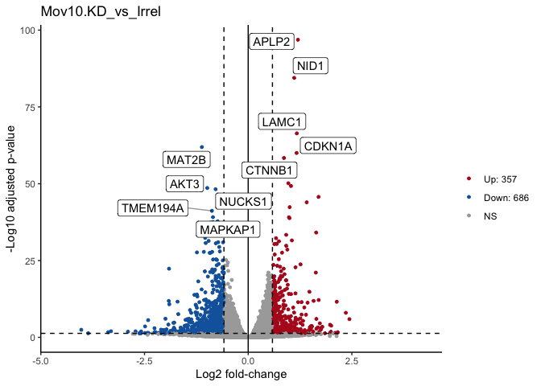

<!--- Allow the page to be wider --->
<style>
    body .main-container {
        max-width: 1200px;
    }
</style>
> # Objectives    
> * Understand advantages of using gene ids when analyzing data.    
> * Given a list of ENSEMBL gene ids, add gene symbols and Entrez accessions.    
> * Generate common visualizations for differential expression comparisons    
> * Understand reasonable thresholds for statistically significant diffex genes    
> * Understand options for functional enrichments    


# Visualizing DE results

Part of differential expression analysis is generating visualizations to share our results. While the DESeq2 tutorial provides [examples of other visualizations](http://bioconductor.org/packages/devel/bioc/vignettes/DESeq2/inst/doc/DESeq2.html#exploring-and-exporting-results), a common visualization to summarize DE comparisons are [volcano plots](http://resources.qiagenbioinformatics.com/manuals/clcgenomicsworkbench/752/index.php?manual=Volcano_plots_inspecting_result_statistical_analysis.html). 

## Generating Volcano plots

As described by this [Galaxy project tutorial](https://galaxyproject.github.io/training-material/topics/transcriptomics/tutorials/rna-seq-viz-with-volcanoplot/tutorial.html), a volcano plot is a type of scatterplot that shows statistical significance (adjusted pvalue) versus magnitude of change (fold change). It allows us to quickly identify genes with large fold changes that are also statistically significant. In a volcano plot, the most upregulated genes are towards the right, the most downregulated genes are towards the left, and the most statistically significant genes are towards the top.

First, we need to set thresholds for determining significant genes. A reasonable threshold would be a fold-change of less than -1.5 or greater than 1.5 and an adjusted pvalue less than 0.05.

```r
fc <- 1.5
pval <- 0.05
```

Then, we need to sep up some object to run our plotting code, creating a new object for our plotting and labeling our comparison of interest. 

```r
df<- res.KD[order(res.KD$padj),] #select our data of interest
df <- as.data.frame(df) #convert our object type
df <- cbind("id" = row.names(df), df) #set rownames to valid column
str(df) 
```

```
## 'data.frame':	19748 obs. of  7 variables:
##  $ id            : Factor w/ 19748 levels "1/2-SBSRNA4",..: 801 11821 8624 10357 3049 3919 19096 3593 17404 490 ...
##  $ baseMean      : num  8392 6125 5683 2195 2752 ...
##  $ log2FoldChange: num  1.2 1.11 1.17 -1.12 1.17 ...
##  $ lfcSE         : num  0.056 0.0554 0.0659 0.0649 0.069 ...
##  $ stat          : num  21.4 20 17.8 -17.2 16.9 ...
##  $ pvalue        : num  8.73e-102 4.42e-89 7.74e-71 2.96e-66 3.17e-64 ...
##  $ padj          : num  1.36e-97 3.44e-85 4.01e-67 1.15e-62 9.86e-61 ...
```

```r
Comparison <- "Mov10.KD_vs_Irrel"
```

Now we need to [subset our data](https://www.statmethods.net/management/subset.html) to label the datapoints (genes) that pass our thresholds.

```r
df$dot <- rep(3, nrow(df))
df$dot[which(df$padj <= pval & df$log2FoldChange < 0 & abs(df$log2FoldChange) >= log2(fc))] = 2
df$dot[which(df$padj <= pval & df$log2FoldChange > 0 & abs(df$log2FoldChange) >= log2(fc))] = 1
df$sig <- df$dot

#take top 5 up, down, then combine, assign label
top <- rbind(head(subset(df, df$dot == 1), 5),head(subset(df, df$dot == 2), 5))
top$label <- top$id
df <- merge(x = df, y = top[,c('id','label')], by = "id", all.x = TRUE)

#count the number of significan up and down genes, assign value for legend
df$dot <- factor(df$dot,levels = c(1,2,3), labels = c(paste0('Up: ', sum(df$dot == 1)),paste0('Down: ', sum(df$dot == 2)),'NS'))
```

Once we've setup the annotations we need, we can proceed with generating the volcano plot.

```r
pdf(file = paste0(plotPath,'VolcanoPlot_', Comparison, '.pdf'), onefile = FALSE)

p <- ggplot(df, aes(x = log2FoldChange, y = -log10(padj))) + geom_point(aes(color = df$dot), size = 1) + theme_classic() + xlab('Log2 fold-change') + ylab('-Log10 adjusted p-value')

p <- p + scale_color_manual(name = '', values=c('#B31B21', '#1465AC', 'darkgray'))

p <- p + geom_vline(xintercept = c(0, -log2(fc), log2(fc)), linetype = c(1, 2, 2), color = c('black', 'black', 'black')) + geom_hline(yintercept = -log10(pval), linetype = 2, color = 'black')

if (sum(is.na(df$label)) < nrow(df)) {
  p <- p + geom_label_repel(label = df$label, force = 3, segment.alpha = 0.4) + ggtitle(as.character(Comparison))
} else {
  p <- p + ggtitle(as.character(comparison))
}

print(p)
dev.off()
```

```
## quartz_off_screen 
##                 2
```

```r
p
```

<!-- -->

How does significance relate to fold change?

For additional visualizations for our DE results, this [HBC tutorial](https://hbctraining.github.io/DGE_workshop/lessons/06_DGE_visualizing_results.html) includes some nice examples.

# How to annotate the results table

It can be useful to annotate our results table with additional information to make them easier to interpret, such as adding additional gene information or better summarizing our DE results.

## Summarizing our DE results

To generate a general summary of the DE results, we can use the `summary` function to generate a basic summary by DESeq2.

However, we can also use conditional statements to determine the number of genes that pass our thresholds for each comparison, which might be more informative.

```r
#summary(res.KD)
sum(res.KD$padj < 0.05 & abs(res.KD$log2FoldChange) >= log2(1.5), na.rm = TRUE)
```

```
## [1] 1043
```

```r
sum(res.OE$padj < 0.05 & abs(res.OE$log2FoldChange) >= log2(1.5), na.rm = TRUE)
```

```
## [1] 1237
```

#### Subsetting significant genes
<details>
  <summary>Click for code</summary>

You may be interested in identifying only the genes that pass your significance thesholds. A useful way to do this is to conditionally subset your results. 

```r
res.KD_sig <- na.omit(res.KD)
res.KD_sig <- res.KD_sig[which(res.KD_sig$padj < 0.05 & abs(res.KD_sig$log2FoldChange) >= log2(1.5)), ]
head(res.KD_sig)
```

For more details about subsetting tables in R, we recommend the [Data Carpentry manipulating and analyzing data module](https://datacarpentry.org/R-ecology-lesson/03-dplyr.html). 

We can also annotate our results to include a column that identifies our significant genes.

```r
res.KD_anno <- res.KD # copy table
# add a column and assign all genes are non-significance
res.KD_anno$Call <- rep(FALSE, length(res.KD$baseMean)) 

# change 'Call' column to TRUE if meets conditions for significant differences
res.KD_anno[which(!is.na(res.KD_anno$padj) & res.KD_anno$padj < 0.05 & abs(res.KD_anno$log2FoldChange) >= log2(1.5)), ]$Call <- TRUE

# reorder table to rank significant genes at the top
res.KD_anno <- res.KD_anno[order(-res.KD_anno$Call),]
```


</details>


## Adding genome annotations

Bioconductor provides many tools and resources to facilitate access to [genomic annotation resources](http://bioconductor.org/packages/devel/workflows/vignettes/annotation/inst/doc/Annotation_Resources.html). 

From the [RNA-Seq methods reported in the Kenny et al paper](https://ars-els-cdn-com.proxy.lib.umich.edu/content/image/1-s2.0-S2211124714009231-mmc1.pdf), we know that the hg19 (UCSC) reference genome was used for alignment. 

We can access additional genomic annotations using the [`bioMart` package](https://bioconductor.org/packages/release/bioc/html/biomaRt.html). To identify  we'll structure our 'query' or search of the bioMart resources to use the gene symbols from our alignment to add the [ENSEMBL id](https://m.ensembl.org/info/genome/genebuild/gene_names.html) and gene description for each gene. 

### Gene symbols versus Gene ids

Since UCSC and ENSEMBL are two difference reference builds not all genes are shared, as outlined in [this comprehensive review of reference genomes by Zhao & Zhang](https://bmcgenomics.biomedcentral.com/articles/10.1186/s12864-015-1308-8). Additionally, since gene symbols can change over time or be ambigous we use and recommend using the EMSEMBL reference genome and ENSEMBL ids for alignments.

To proceed with our BioMart query, we will first load the biomaRt library & choose what reference we want to access.

```r
library("biomaRt")
ensembl <- useMart("ensembl",dataset="hsapiens_gene_ensembl")
```

To identify possible **filters** to restrict our data, we can use the `listFilters` function. To identify the **attributes** we want to retrive, we can use the `listAttributes` function. There are also [search functions](https://bioconductor.org/packages/release/bioc/vignettes/biomaRt/inst/doc/accessing_ensembl.html#how-to-build-a-biomart-query) to help narrow down the available options.

```r
head(listFilters(mart = ensembl))
```

```
##              name              description
## 1 chromosome_name Chromosome/scaffold name
## 2           start                    Start
## 3             end                      End
## 4      band_start               Band Start
## 5        band_end                 Band End
## 6    marker_start             Marker Start
```

```r
head(listAttributes(ensembl))
```

```
##                            name                  description         page
## 1               ensembl_gene_id               Gene stable ID feature_page
## 2       ensembl_gene_id_version       Gene stable ID version feature_page
## 3         ensembl_transcript_id         Transcript stable ID feature_page
## 4 ensembl_transcript_id_version Transcript stable ID version feature_page
## 5            ensembl_peptide_id            Protein stable ID feature_page
## 6    ensembl_peptide_id_version    Protein stable ID version feature_page
```

Next, we'll [build our query](https://bioconductor.org/packages/release/bioc/vignettes/biomaRt/inst/doc/accessing_ensembl.html#how-to-build-a-biomart-query) to retrive the information we want to add to our DE results table.

```r
GeneKey <- getBM(attributes=c('ensembl_gene_id', 'hgnc_symbol', "description"), 
      filters = 'hgnc_symbol', 
      values = row.names(assay(dds)), 
      mart = ensembl) # will take some time to run
```

```
## Cache found
```

```r
head(GeneKey)
```

```
##   ensembl_gene_id hgnc_symbol
## 1 ENSG00000121410        A1BG
## 2 ENSG00000268895    A1BG-AS1
## 3 ENSG00000148584        A1CF
## 4 ENSG00000175899         A2M
## 5 ENSG00000166535       A2ML1
## 6 ENSG00000256069       A2MP1
##                                                          description
## 1             alpha-1-B glycoprotein [Source:HGNC Symbol;Acc:HGNC:5]
## 2           A1BG antisense RNA 1 [Source:HGNC Symbol;Acc:HGNC:37133]
## 3 APOBEC1 complementation factor [Source:HGNC Symbol;Acc:HGNC:24086]
## 4              alpha-2-macroglobulin [Source:HGNC Symbol;Acc:HGNC:7]
## 5   alpha-2-macroglobulin like 1 [Source:HGNC Symbol;Acc:HGNC:23336]
## 6 alpha-2-macroglobulin pseudogene 1 [Source:HGNC Symbol;Acc:HGNC:8]
```


Now that we have the ENSEMBL information and a gene symbol to match to our results, we can add this to our DE results table.

```r
res.KD_anno <- res.KD # copy table
res.KD_anno <- cbind(genes=row.names(res.KD_anno), res.KD_anno[ ,c(1:6)])
res.KD_anno <- as.data.frame(res.KD_anno)

res.KD_anno <- merge(GeneKey, res.KD_anno, by.x = "hgnc_symbol", by.y="genes", all.x = FALSE, all.y = TRUE) # combine the two tables using the merge function
head(res.KD_anno)
```

```
##   hgnc_symbol ensembl_gene_id
## 1 1/2-SBSRNA4            <NA>
## 2        A1BG ENSG00000121410
## 3    A1BG-AS1 ENSG00000268895
## 4        A1CF ENSG00000148584
## 5       A2LD1            <NA>
## 6         A2M ENSG00000175899
##                                                          description
## 1                                                               <NA>
## 2             alpha-1-B glycoprotein [Source:HGNC Symbol;Acc:HGNC:5]
## 3           A1BG antisense RNA 1 [Source:HGNC Symbol;Acc:HGNC:37133]
## 4 APOBEC1 complementation factor [Source:HGNC Symbol;Acc:HGNC:24086]
## 5                                                               <NA>
## 6              alpha-2-macroglobulin [Source:HGNC Symbol;Acc:HGNC:7]
##      baseMean log2FoldChange     lfcSE       stat     pvalue      padj
## 1  45.6520399    -0.04595308 0.2983080 -0.1540458 0.87757365 0.9309016
## 2  61.0931017    -0.46953059 0.2599740 -1.8060676 0.07090778 0.1625532
## 3 175.6658069    -0.03571713 0.1512352 -0.2361695 0.81330114 0.8921448
## 4   0.2376919     1.31531242 3.9054773  0.3367866 0.73627778        NA
## 5  89.6179845     0.21994150 0.2169029  1.0140089 0.31057849 0.4784013
## 6   5.8600841     0.10499013 0.7455213  0.1408278 0.88800597 0.9374102
```

Notice that not all genes were annotated with an ENSEMBl gene id or gene description. While we are able to annotate our results, we should be very cautious as the gene symbol is not a good unique identifier plus we did not use a UCSC annotation resource so the HUGO gene symbol may not always match. However, this code is similar to the steps needed to annotate ENSEMBL id based results, like what would have been generated from yesterday's alignments, with more interpretable gene symbols.

>**Note**: For additional information regarding bioMart, please consult the [ENSEMBL bioMart vignette](https://bioconductor.org/packages/release/bioc/vignettes/biomaRt/inst/doc/accessing_ensembl.html) or the broader [Bioconductor Annotation Resources vignette ](http://bioconductor.org/packages/devel/workflows/vignettes/annotation/inst/doc/Annotation_Resources.html).

# Outputting results to file

A key aspect of our analysis is preserving the relevant datasets for both our records and for downstream applications.

## Count tables

The most relevant count tables are the raw, filtered count table that we used as the input for our analysis and the rlog normalized count table that we used for our quality control visualizations.

First, we'll setup a new directory for our output tables.

```r
dir.create("./OutputTables")
```

```
## Warning in dir.create("./OutputTables"): './OutputTables' already exists
```

To output the raw counts, we will need to use the `counts` function to access the count table from within its larger `DESeqDataSet` object.

```r
write.csv(counts(dds, normalized = FALSE), file="./OutputTables/DESeq2_raw_counts.csv")
```

Then we'll output the rlog count table, using the `assay` function to access the normalized count table from within its larger `DESeqDataSet` object.

```r
write.csv(assay(rld), file="./OutputTables/DESeq2_rlogNormalized_counts.csv")
```

## DE results table

Next we'll write out our DE results for the KD comparison to file ,since we added additional information to that table. 

```r
write.csv(res.KD_anno, 
          row.names = FALSE,
          na = ".",
          file="./OutputTables/Mov10.KD_vs_Irrel_DESeq2.csv")
```

For the OE comparsion, we could repeat our annotations or write the DE results directly to file using the `assay` function for the DESeqDataSet object.

# What can we do with our DE results?

Now that we have our DE results, have we address the biological question relevant to the authors of the [original paper](http://www.ncbi.nlm.nih.gov/pubmed/25464849)? On the one hand, yes - we now have two tables of genes that are impacted by change in Mov10 expression. But with two lists of genes alone, it can be difficult to find patterns or understand broader biological impacts.

What if we wanted to find out what genes were signifant in *both* comparisons? The `intersect` function, such as implimented as [part of the dplyr package](https://www.datasciencemadesimple.com/intersect-function-r-using-dplyr-intersection-data-frames/) would be useful to identify shared significant genes. A [venn diagram](https://www.r-graph-gallery.com/14-venn-diagramm.html) could be a way to visualize these overlaps. 

A way to determine possible [broader biological interpretations](https://www.ebi.ac.uk/training-beta/online/courses/functional-genomics-ii-common-technologies-and-data-analysis-methods/biological-interpretation-of-gene-expression-data-2/) from the observed DE results, is functional enrichments. There are many options, such as some included in this [discussion thread](https://www.researchgate.net/post/How_can_I_analyze_a_set_of_DEGs_differentially_expressed_genes_to_obtain_information_from_them). Other common functional enrichments approaches are gene set enrichment analysis, aka [GSEA](http://software.broadinstitute.org/gsea/index.jsp), Database for Annotation, Visualization and Integrated Discovery, aka [DAVID](https://david.ncifcrf.gov/), [Ingenity](https://digitalinsights.qiagen.com/), and [iPathway Guide]

The University of Michigan has license and support for additional tools, such as Cytoscape, so we recommend reaching out to staff with [Taubman Library](https://www.lib.umich.edu/locations-and-hours/taubman-health-sciences-library/research-and-clinical-support) to learn more about resources that might be application toyour research.

# Review of Kenny et al results

From the results [reported in the Kenny PJ et al paper](http://www.ncbi.nlm.nih.gov/pubmed/25464849), we identified fewer DE genes than their analysis. From their [RNA-Seq methods](https://ars-els-cdn-com.proxy.lib.umich.edu/content/image/1-s2.0-S2211124714009231-mmc1.pdf), we know that they used a different tool, EdgeR, but they only used a significance threshold to call DE genes. 

How many DE genes would we have if we only apply a threshold to our adjusted pvalues?

```r
sum(res.KD$padj < 0.05, na.rm = TRUE)
```

```
## [1] 4909
```

If we threshold only on significance, we still identify less DE genes than the 6057 identified in the paper. How should we interpret these differences? Are we in danger of missing relevant genes or, due to DESeq2's stringency, are we better protected against irrelevant genes? One of the authors of DESeq2, wrote this [blog post that detailed differences between DESeq2 and EdgeR ](https://mikelove.wordpress.com/2016/09/28/deseq2-or-edger/) but this [review of multiple DE tools by Costa-Silva, Domingues, and Martins Lopes](https://www.ncbi.nlm.nih.gov/pmc/articles/PMC5739479/) may also be useful for forming your own opinion.

---

# Sources Used      
* HBC DGE training module, part 1: https://hbctraining.github.io/DGE_workshop/lessons/04_DGE_DESeq2_analysis.html    
* HBC DGE training module, part 2: https://hbctraining.github.io/DGE_workshop/lessons/05_DGE_DESeq2_analysis2.html    
* DESeq2 vignette: http://bioconductor.org/packages/devel/bioc/vignettes/DESeq2/inst/doc/DESeq2.html#differential-expression-analysis    
* Bioconductor Genomic Annotation resources: http://bioconductor.org/packages/devel/workflows/vignettes/annotation/inst/doc/Annotation_Resources.html    
* BioMart vignette: https://bioconductor.org/packages/release/bioc/vignettes/biomaRt/inst/doc/accessing_ensembl.html    


# Additional Resources
* MIDAS Reproduciblity Hub: https://midas.umich.edu/reproducibility-overview/
* ARC resources: https://arc-ts.umich.edu/
* Gene Set Enrichment Resources from Bioconductor: https://bioinformatics-core-shared-training.github.io/cruk-summer-school-2018/RNASeq2018/html/06_Gene_set_testing.nb.html
* Using HTSeq data with DESeq2: https://angus.readthedocs.io/en/2019/diff-ex-and-viz.html
* Detailed RNA-seq analysis paper: https://www.ncbi.nlm.nih.gov/pmc/articles/PMC6096346/
* Overview of RNA-seq analysis considerations: https://academic-oup-com.proxy.lib.umich.edu/bfg/article/14/2/130/257370

---

# Session Info    

```r
sessionInfo()
```

```
## R version 3.6.1 (2019-07-05)
## Platform: x86_64-apple-darwin15.6.0 (64-bit)
## Running under: macOS Mojave 10.14.6
## 
## Matrix products: default
## BLAS:   /Library/Frameworks/R.framework/Versions/3.6/Resources/lib/libRblas.0.dylib
## LAPACK: /Library/Frameworks/R.framework/Versions/3.6/Resources/lib/libRlapack.dylib
## 
## locale:
## [1] en_US.UTF-8/en_US.UTF-8/en_US.UTF-8/C/en_US.UTF-8/en_US.UTF-8
## 
## attached base packages:
## [1] parallel  stats4    stats     graphics  grDevices utils     datasets 
## [8] methods   base     
## 
## other attached packages:
##  [1] biomaRt_2.42.1              RColorBrewer_1.1-2         
##  [3] pheatmap_1.0.12             ggrepel_0.8.2              
##  [5] dplyr_1.0.2                 tidyr_1.1.2                
##  [7] ggplot2_3.3.2               DESeq2_1.26.0              
##  [9] SummarizedExperiment_1.16.1 DelayedArray_0.12.3        
## [11] BiocParallel_1.20.1         matrixStats_0.57.0         
## [13] Biobase_2.46.0              GenomicRanges_1.38.0       
## [15] GenomeInfoDb_1.22.1         IRanges_2.20.2             
## [17] S4Vectors_0.24.4            BiocGenerics_0.32.0        
## 
## loaded via a namespace (and not attached):
##  [1] bitops_1.0-6           bit64_4.0.5            progress_1.2.2        
##  [4] httr_1.4.2             tools_3.6.1            backports_1.1.10      
##  [7] R6_2.4.1               rpart_4.1-15           Hmisc_4.4-1           
## [10] DBI_1.1.0              colorspace_1.4-1       nnet_7.3-14           
## [13] withr_2.3.0            tidyselect_1.1.0       gridExtra_2.3         
## [16] prettyunits_1.1.1      curl_4.3               bit_4.0.4             
## [19] compiler_3.6.1         htmlTable_2.1.0        labeling_0.3          
## [22] scales_1.1.1           checkmate_2.0.0        genefilter_1.68.0     
## [25] askpass_1.1            rappdirs_0.3.1         stringr_1.4.0         
## [28] digest_0.6.25          foreign_0.8-72         rmarkdown_2.4         
## [31] XVector_0.26.0         base64enc_0.1-3        jpeg_0.1-8.1          
## [34] pkgconfig_2.0.3        htmltools_0.5.0        dbplyr_1.4.4          
## [37] htmlwidgets_1.5.1      rlang_0.4.7            rstudioapi_0.11       
## [40] RSQLite_2.2.1          generics_0.0.2         farver_2.0.3          
## [43] RCurl_1.98-1.2         magrittr_1.5           GenomeInfoDbData_1.2.2
## [46] Formula_1.2-3          Matrix_1.2-18          Rcpp_1.0.5            
## [49] munsell_0.5.0          lifecycle_0.2.0        stringi_1.5.3         
## [52] yaml_2.2.1             zlibbioc_1.32.0        BiocFileCache_1.10.2  
## [55] grid_3.6.1             blob_1.2.1             crayon_1.3.4          
## [58] lattice_0.20-41        splines_3.6.1          annotate_1.64.0       
## [61] hms_0.5.3              locfit_1.5-9.4         knitr_1.30            
## [64] pillar_1.4.6           geneplotter_1.64.0     XML_3.99-0.3          
## [67] glue_1.4.2             evaluate_0.14          latticeExtra_0.6-29   
## [70] data.table_1.12.8      png_0.1-7              vctrs_0.3.4           
## [73] gtable_0.3.0           openssl_1.4.3          purrr_0.3.4           
## [76] assertthat_0.2.1       xfun_0.18              xtable_1.8-4          
## [79] survival_3.2-7         tibble_3.0.3           AnnotationDbi_1.48.0  
## [82] memoise_1.1.0          cluster_2.1.0          ellipsis_0.3.1
```

---

These materials have been adapted and extended from materials listed above. These are open access materials distributed under the terms of the [Creative Commons Attribution license (CC BY 4.0)](http://creativecommons.org/licenses/by/4.0/), which permits unrestricted use, distribution, and reproduction in any medium, provided the original author and source are credited.
