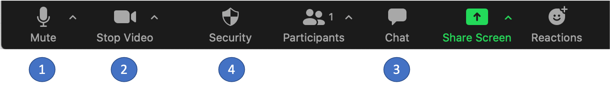

# Welcome to RNA-Seq Demystified

## About this workshop

- By the end of the workshop, attendees will be able to
  - Articulate the impact of experimental design and sequencing protocol on analytical results 
  - Transform raw sequencing data into annotated differential expression values using a suite of 
    open-source tools.
  - Identify common data quality problems and understand their impact and possible mitigations 

- This workshop is targeted toward researchers who would like to be able to run RNA-Seq analysis on their 
  own. It assumes a very basic familiarity with genetics, the command line, and R or R-Studio.

- Our purpose is not to be exhaustive, and we don't expect anyone to be an expert at the end of
  the workshop. But we hope you will have a familiarity with key concepts, data types, 
  tools, and how they all connect to one another in the service of a biological question.
- The first day will be a mix of hands-on content and lecture-style components, while the second 
  day will primarily be a hands-on experience.

- This is a pilot of this workshop. We expect this to be an opportunity for you to learn more about RNA-
  Seq analysis and for us to test out our workshop content and delivery. We will be asking you for specific 
  feedback in a post-workshop survey; in the interim, please let us know if there is anything we can do to 
  improve the workshop experience. 

## Thanks to our sponsors

- [Biomedical Research Core Facilities](https://brcf.medicine.umich.edu/)

  Biomedical Research Core Facilities (BRCF) helps researchers economically take advantage of 
  the latest technology and collaborate with top experts in the field. Established in 1986, the 
  BRCF was formed to offer centralized access to research services and equipment.

- [University of Michigan Library](https://www.lib.umich.edu/) 
  
  Our mission is to support, enhance, and collaborate in the instructional, research, and 
  service activities of faculty, students, and staff, and contribute to the common good by 
  collecting, organizing, preserving, communicating, sharing, and creating the record of human 
  knowledge.
  
- [Michigan Institute for Data Science (MIDAS)](https://midas.umich.edu/)
  
  To strengthen University of Michigan’s preeminence in Data Science and to catalyze the    
  transformative use of Data Science in a wide range of disciplines to achieve lasting societal 
  impact.

## What is the Bioinformatics Core?

- The UM Bioinformatics Core is a team seven analysts; we help researchers **design, analyze, 
  and interpret** high-throughput genomics experiments.
- Last year we helped about 60 researchers design and execute about 100 projects across:
    - gene expression
    - variant calling, copy-number analysis
    - chromatin accessibility and binding
    - DNA methylation
    - single-cell experiments
    - custom bioinformatic analyses
- We provide letters of support for grant proposals.
- We are also creating a series of bioinformatics-focused workshops (!)

## Who are your hosts/instructors?

- Chris Gates cgates@umich.edu
- Marci Brandenburg mbradenb@umich.edu
- Dana King damki@umich.edu
- Raymond Calvalcante rcavalca@umich.edu
- Helpers

# Housekeeping

## Code of Conduct (CoC)

- Be kind to others. Do not insult or put down others. Behave professionally. Remember that 
  harassment and sexist, racist, or exclusionary jokes are not appropriate for the workshop.

- All communication should be appropriate for a professional audience including people of many 
  different backgrounds. Sexual language and imagery is not appropriate.

- The Bioinformatics Core is dedicated to providing a harassment-free community for everyone, 
  regardless of gender, sexual orientation, gender identity and expression, disability, physical 
  appearance, body size, race, or religion. We do not tolerate harassment of participants in any 
  form.

- Thank you for helping make this a welcoming, friendly community for all.

- If you have questions about the CoC please reach out to the hosts during the workshop, or 
  email us at bioinformatics-workshops@umich.edu.

- To report a CoC incident/concern, please email Chris Gates (Bioinformatics Core, Managing 
  Director) at cgates@umich.edu or contact the University of Michigan Office of Institutional 
  Equity at institutional.equity@umich.edu.

## Workshop patterns and Zoom controls

- We will be recording this session. Recordings will be available to participants following 
  the workshop.
  
- Zoom controls are at the bottom of the Zoom window:

- To mininize distractions, we encourage participants to keep their audio muted (1) (unless 
  actively asking a question).
- To maximize engagement, we encourage participants to keep their viedo on.
- **Chat** can be used to communicate to the group or to individuals.
- **Participants** is another way to communicate using "non-verbal controls"

  - **Raise Hand** to request clarification or ask a question. (Same an in-person workshop.)
  - **Yes** when you complete an assigned task or other instructor feedback
  - **No** to request assistance from helper
    - Hosts will start a private **Chat** and connect you with a helper in a breakout room.

### Breakout Rooms

- We're all going to be transported into randomized breakout rooms to see what that's like.
- Introduce yourself. Tell the others in your breakout room what you hope to learn from the course.
- When you have completed introductions, you can leave the breakout room to rejoin the main room.

### Schedule

| Time | Topic | Instructor |
| ---- | ----------------- | ---------- |
| **Day One** |
| 9:00 | [Workshop Introduction](https://umich-brcf-bioinf.github.io/rnaseq_demystified_workshop/site/Module1_Introduction) | Chris Gates |
| 9:15 | [UNIX Shell Introduction](https://umich-brcf-bioinf.github.io/rnaseq_demystified_workshop/site/Module2a_UNIXShell) | Raymond Cavalcante |
| 10:00 | [Experimental Design, Library Prep, and Sequencing](https://umich-brcf-bioinf.github.io/rnaseq_demystified_workshop/site/Module3a_Design_Prep_Seq) | Raymond Cavalcante |
|  | [Data QC](https://umich-brcf-bioinf.github.io/rnaseq_demystified_workshop/site/Module3b_QC) | Raymond Cavalcante |
| 11:00 | [Reference Genomes](https://umich-brcf-bioinf.github.io/rnaseq_demystified_workshop/site/Module4a_Reference_Genomes) | Raymond Cavalcante |
|  | [Sequence Alignment and Gene Quantification with STAR/RSEM](https://umich-brcf-bioinf.github.io/rnaseq_demystified_workshop/site/Module4b_Alignment) | Raymond Cavalcante |
| 12:30 | Review, Questions, Prep for Day 2 | |
| **Day Two** |
| 9:00 | Intro Day 2 | Chris Gates |
| 9:10 | [Introduction To R/RStudio](https://umich-brcf-bioinf.github.io/rnaseq_demystified_workshop/site/Module7a_IntroductionToR)&nbsp;&nbsp;&nbsp;&nbsp;&nbsp;&nbsp;&nbsp;&nbsp;&nbsp;&nbsp;&nbsp;&nbsp;&nbsp;&nbsp;&nbsp;&nbsp;&nbsp;&nbsp;&nbsp;&nbsp;&nbsp;&nbsp;&nbsp;&nbsp; | Dana King |
|  | [Introduction to DESeq2](https://umich-brcf-bioinf.github.io/rnaseq_demystified_workshop/site/Module8a_IntroductionToDESeq2) | Dana King |
| 10:00 | [DESeq2 Initialization](https://umich-brcf-bioinf.github.io/rnaseq_demystified_workshop/site/Module8b_DESeq2Initialization) | Dana King |
|  | [DESeq2 Differential Expression](https://umich-brcf-bioinf.github.io/rnaseq_demystified_workshop/site/Module8d_DESeq2DifferentialExpression) | Dana King |
| 11:00 | [Sample Visualizations for QC](https://umich-brcf-bioinf.github.io/rnaseq_demystified_workshop/site/Module9a_SampleVisualizations) | Dana King |
|  | [DE Comparisons and Gene Annotations](https://umich-brcf-bioinf.github.io/rnaseq_demystified_workshop/site/Module10a_DEComparisons) | Dana King |
| 12:00 | [DE Visualizations and output files](https://umich-brcf-bioinf.github.io/rnaseq_demystified_workshop/site/Module10b_DEVisualizations) | Dana King |
| 12:45  | [Wrap-up](https://umich-brcf-bioinf.github.io/rnaseq_demystified_workshop/site/Module99_Wrap_up) | Chris Gates |

### Any questions?
 -
 -
 
 
 
---

*The workshop Code of Conduct has been adapted the NumFocus Code of Conduct (https://numfocus.org/code-of-conduct) which itself draws frin from numerous sources, including the Geek Feminism wiki, created by the Ada Initiative and other volunteers, which is under a Creative Commons Zero license, the Contributor Covenant version 1.2.0, the Bokeh Code of Conduct, the SciPy Code of Conduct, the Carpentries Code of Conduct, and the NeurIPS Code of Conduct.

This workshop Code of Conduct is licensed under a [Creative Commons Attribution 3.0 Unported License](https://creativecommons.org/licenses/by/3.0/).
