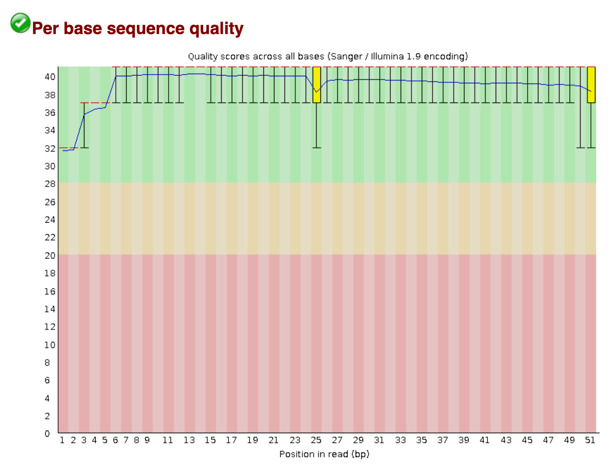
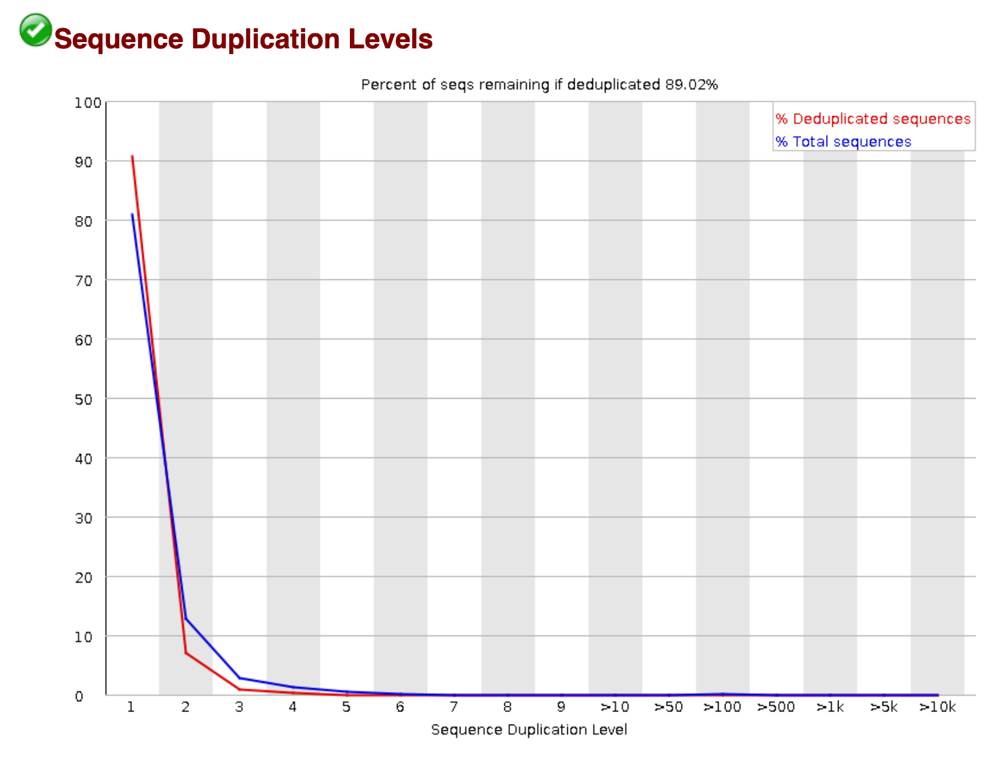

<!---
library(rmarkdown)
render('Module3b_QC.Rmd', output_dir = 'site')
--->

<!--- Allow the page to be wider --->
<style>
    body .main-container {
        max-width: 1200px;
    }
</style>

> # Objectives
> * Understand what a FASTQ file is.
> * Understand how to use FastQC and MultiQC to assess the quality of sequencing reads.
> * Understand how to interpret FastQC reports.
> * Understand how to transfer files on a remote server to a personal computer.

# Differential Expression Workflow

As a reminder, our overall differential expression workflow is shown below. In this lesson, we will go over the bold part of the workflow.

| Step | Task |
| :--: | ---- |
| 1 | Experimental Design |
| 2 | Biological Samples / Library Preparation |
| 3 | Sequence Reads |
| **4** | **Assess Quality of Raw Reads** |
| 5 | Splice-aware Mapping to Genome |
| 6 | Count Reads Associated with Genes |
| 7 | Test for DE Genes |

# Data Types

Analysis of RNA-seq data requires the use of many types of data. The three most common that we will encounter are:

- Sequence data
- Genome feature data
- Alignment data

We will introduce each data type and their formats in more detail as they enter the workflow, but for now some general notes about the formats we will encounter:

- File formats represent the data in a structured manner.
- Some file formats are not human-readable; they are binary, and we will see what that means when we discuss alignments.
- Many file formats are human readble, but very large. **These files should not be viewed in Word or Excel.**

## FASTQ Files

Raw sequenced reads are stored in [FASTQ](https://en.wikipedia.org/wiki/FASTQ_format) format. This is a plain text, human readable file format that stores information about each read. For a single read there are four lines:

```
@A00437:266:HVFMYDSXX:1:1101:1181:1000 1:N:0:AGCCTATC+TGCGTAAC
TTTATTGTTGATGGTTATTTTTTGTTTATGGTTATTTTGTGTTTATGGTTATTTTTTGTTTATGGTTATTTTTTA
+
FFFFFFFFFFFFFFFFFFFFFFFFFFFFFFFFFFFFFFFFFFFFFFFFFFFFFFFFFFFFFFFFFFFFFFFFFFF
```

| Line | Description |
| :--: | ----------- |
| 1 | Begins with `@` and has information about the read. From AGC will contain flowcell and barcode information. |
| 2 | The DNA sequence. |
| 3 | Always begins with `+` and may contain the same information as line 1. |
| 4 | A string of characters representing the quality scores. Always the same number of characters as line 2. |

### Base Quality Scores

The fourth line encodes the quality of each nucleotide in the read. The most common encoding is referred to as PHRED-33, and the following maps characters to qualities:

```
 Quality encoding: !"#$%&'()*+,-./0123456789:;<=>?@ABCDEFGHI
                   |         |         |         |         |
    Quality score: 0........10........20........30........40
```

The above example is a rather boring read with all bases having `F`, meaning a score of 37, which is good. Each quality score represents the probability that the corresponding nucleotide call is incorrect. The quality score is logarithmic and is calculated as:

```
Q = -10 x log10(P), where P is the probability that the base call is erroneous
```

Another way to interpret the scores is in terms of the following table:

| PHRED Quality Score | Probability of incorrect base call | Base call accuracy |
| ------------------- | ---------------------------------- | ------------------ |
| 10 | 1 in 10 | 90% |
| 20 | 1 in 100 | 99% |
| 30 | 1 in 1000 | 99.9% |
| 40 | 1 in 10000 | 99.99% |

It would clearly be painstaking to go through all the base quality scores of all the millions of reads obtained from a sequencing run, so we typically don't evaluate the FASTQ files by sight. Instead, we use tools that take in FASTQ files and summarize the base quality scores (and other characteristics) to determine the overall quality of the reads from the sequencer.

# Quality Assessment with FastQC

The first step in most high-throughput sequencing analyses is to examine the quality of the raw reads with [FastQC](https://www.bioinformatics.babraham.ac.uk/projects/fastqc/). It analyzes various aspects of each FASTQ file and gives a quick impression of the overall quality of the data before proceeding with downstream analysis. The following modules are present in an easy to read HTML report.

- Read quality score per base (by interpreting the PHRED33 scores)
- Per tile sequencing quality (related to sequencing clusters on the flowcell)
- Read lengths
- GC content
- Adapter content
- Overrepresented sequences

## Running FastQC

Let's run FastQC on some example FASTQ files we've provided in the `~/workshop_data` folder. If you're not already logged in to the Amazon instance, please do so with your user name replacing `rcavalca` and using the password provided to you:

```
$ ssh rcavalca@ec2-50-17-210-255.compute-1.amazonaws.com
```

As we learned in the previous UNIX module, we can use the `--help` flag to look at the options for programs. It's a good habit, before using a tool for the first time, to read through the options and syntax for how to invoke a program.

```
$ fastqc --help

            FastQC - A high throughput sequence QC analysis tool

SYNOPSIS

	fastqc seqfile1 seqfile2 .. seqfileN

    fastqc [-o output dir] [--(no)extract] [-f fastq|bam|sam]
           [-c contaminant file] seqfile1 .. seqfileN

DESCRIPTION

    FastQC reads a set of sequence files and produces from each one a quality
    control report consisting of a number of different modules, each one of
    which will help to identify a different potential type of problem in your
    data.

    If no files to process are specified on the command line then the program
    will start as an interactive graphical application.  If files are provided
    on the command line then the program will run with no user interaction
    required.  In this mode it is suitable for inclusion into a standardised
    analysis pipeline.

    The options for the program as as follows:

    -h --help       Print this help file and exit

    -v --version    Print the version of the program and exit

    -o --outdir     Create all output files in the specified output directory.
                    Please note that this directory must exist as the program
                    will not create it.  If this option is not set then the
                    output file for each sequence file is created in the same
                    directory as the sequence file which was processed.

    --casava        Files come from raw casava output. Files in the same sample
                    group (differing only by the group number) will be analysed
                    as a set rather than individually. Sequences with the filter
                    flag set in the header will be excluded from the analysis.
                    Files must have the same names given to them by casava
                    (including being gzipped and ending with .gz) otherwise they
                    won't be grouped together correctly.

    --nano          Files come from nanopore sequences and are in fast5 format. In
                    this mode you can pass in directories to process and the program
                    will take in all fast5 files within those directories and produce
                    a single output file from the sequences found in all files.

    --nofilter      If running with --casava then don't remove read flagged by
                    casava as poor quality when performing the QC analysis.

    --extract       If set then the zipped output file will be uncompressed in
                    the same directory after it has been created.  By default
                    this option will be set if fastqc is run in non-interactive
                    mode.

    -j --java       Provides the full path to the java binary you want to use to
                    launch fastqc. If not supplied then java is assumed to be in
                    your path.

    --noextract     Do not uncompress the output file after creating it.  You
                    should set this option if you do not wish to uncompress
                    the output when running in non-interactive mode.

    --nogroup       Disable grouping of bases for reads >50bp. All reports will
                    show data for every base in the read.  WARNING: Using this
                    option will cause fastqc to crash and burn if you use it on
                    really long reads, and your plots may end up a ridiculous size.
                    You have been warned!

    --min_length    Sets an artificial lower limit on the length of the sequence
                    to be shown in the report.  As long as you set this to a value
                    greater or equal to your longest read length then this will be
                    the sequence length used to create your read groups.  This can
                    be useful for making directly comaparable statistics from
                    datasets with somewhat variable read lengths.

    -f --format     Bypasses the normal sequence file format detection and
                    forces the program to use the specified format.  Valid
                    formats are bam,sam,bam_mapped,sam_mapped and fastq

    -t --threads    Specifies the number of files which can be processed
                    simultaneously.  Each thread will be allocated 250MB of
                    memory so you shouldn't run more threads than your
                    available memory will cope with, and not more than
                    6 threads on a 32 bit machine

    -c              Specifies a non-default file which contains the list of
    --contaminants  contaminants to screen overrepresented sequences against.
                    The file must contain sets of named contaminants in the
                    form name[tab]sequence.  Lines prefixed with a hash will
                    be ignored.

    -a              Specifies a non-default file which contains the list of
    --adapters      adapter sequences which will be explicity searched against
                    the library. The file must contain sets of named adapters
                    in the form name[tab]sequence.  Lines prefixed with a hash
                    will be ignored.

    -l              Specifies a non-default file which contains a set of criteria
    --limits        which will be used to determine the warn/error limits for the
                    various modules.  This file can also be used to selectively
                    remove some modules from the output all together.  The format
                    needs to mirror the default limits.txt file found in the
                    Configuration folder.

   -k --kmers       Specifies the length of Kmer to look for in the Kmer content
                    module. Specified Kmer length must be between 2 and 10. Default
                    length is 7 if not specified.

   -q --quiet       Supress all progress messages on stdout and only report errors.

   -d --dir         Selects a directory to be used for temporary files written when
                    generating report images. Defaults to system temp directory if
                    not specified.

BUGS

    Any bugs in fastqc should be reported either to simon.andrews@babraham.ac.uk
    or in www.bioinformatics.babraham.ac.uk/bugzilla/
```

In particular, under the `SYNOPSIS` section, we see that the basic way to invoke `fastqc` is:

```
fastqc seqfile1 seqfile2 .. seqfileN
```

We also observe that if we want to put the result in a directory, we have to create it ourselves. The `--outdir` option notes "that this directory must exist as the program will not create it."

```
$ cd ~/workshop_data
$ mkdir -p fastqc
$ fastqc --outdir fastqc \
    fastqs/example_R1.fastq.gz \
    fastqs/example_R2.fastq.gz
```

To see what was created, we can look inside the `fastqc` output directory (your output might look a little different because you have a different user name and you did it on a different date):

```
$ ll fastqc
total 884
drwxrwxr-x 2 rcavalca rcavalca   4096 Dec 14 00:36 ./
drwxrwxr-x 5 rcavalca rcavalca   4096 Dec 14 00:36 ../
-rw-rw-r-- 1 rcavalca rcavalca 226826 Dec 14 00:36 example_R1_fastqc.html
-rw-rw-r-- 1 rcavalca rcavalca 223962 Dec 14 00:36 example_R1_fastqc.zip
-rw-rw-r-- 1 rcavalca rcavalca 225038 Dec 14 00:36 example_R2_fastqc.html
-rw-rw-r-- 1 rcavalca rcavalca 216159 Dec 14 00:36 example_R2_fastqc.zip
```

We can see some HTML reports, but there isn't a way to open them on the remote machine in the command-line interface (CLI). This is a good opportunity to learn how to pull files from a remote server onto the computer we're using.

### Transferring Files

We will use a UNIX tool called `scp` (secure copy) to transfer the HTML files to our desktop so that we can open them in a web browser. In `gitbash` or `terminal` on **your computer**, type:

```
$ scp
usage: scp [-346BCpqrTv] [-c cipher] [-F ssh_config] [-i identity_file]
            [-J destination] [-l limit] [-o ssh_option] [-P port]
            [-S program] source ... target
```

We can see various options that we can explore in more detail with `man scp` if we wanted, but it seems that we just need to specify the `source` (where the file is on the remote machine) and the `target` (where we want to put the file on the local machine).

So let's try the following, note you will be asked for the password you used to log in to the Amazon instance:

```
$ scp rcavalca@ec2-50-17-210-255.compute-1.amazonaws.com:~/workshop_data/fastqc/example_R1_fastqc.html ~/Desktop
$ scp rcavalca@ec2-50-17-210-255.compute-1.amazonaws.com:~/workshop_data/fastqc/example_R2_fastqc.html ~/Desktop
```

The files should now be on the desktop of the computer you are using. Double clicking the files will open them in a web browser.

## Interpreting FastQC

FastQC reports are organized around the the different modules characterizing different aspects of the reads. The FastQC [help page](https://www.bioinformatics.babraham.ac.uk/projects/fastqc/Help/) has detailed descriptions for each module.

The report summary is a PASS, WARN, FAIL overview of the modules. It's important to not take them too seriously in all cases as there are a number of assumptions that go into the thresholds that may not apply in your particular experiment.

An important note: For computational reasons, FastQC only evaluates the first 100,000 reads in a FASTQ file. The assumption is that the first 100,000 reads sufficiently represent the full library.

### Per base sequence quality

A per base boxplot of the quality scores with helpful coloring for good, fair, and poor qualities. If a sample has quality scores that degrade at the 3' end of a read (as in the second example below), the sample doesn't necessarily have to be dropped. Some aligners, e.g. STAR, will automatically trim poor quality read ends.

<center>

{ width=75% }

An example of a good quality run.

</center>

<center>


An example of a poor quality run.

</center>

### Sequence Duplication

High sequence duplication, indicated by a skew to the right of the blue curve in the plots below, can be caused by low complexity libraries, too many cycles of PCR amplification, or too little starting material.

On the other hand, if the library was prepared with an enrichment step (e.g. ChIP-seq), then sequence duplication might not be unexpected.

<center>

{ width=75% }

An example of a sample with low sequence duplication levels.

</center>

<center>


An example of a sample with high sequence duplication levels.

</center>

### Overrepresented sequences

Overrepresented sequences are those making up more than 0.1% of the total (of the 100,000 reads sampled). Finding an overrepresented sequence is an indication of something biologically meaningful (e.g. an enrichment step in the library prep process), or it is an issue stemming from the library preparation process (e.g. adapters, a failure to fully remove polyA tails, or contamination).

<center>


We see that there is a high number of reads with polyA tails. This could be a result of an inefficient removal of polyA tails.

</center>

#### Adapter Content

Adapter sequence typically is not present in standard RNA-seq libraries. However, if the fragment sizes resulting from library prep are smaller than the read length on the sequencer, then it is possible to get "read-through" of the adapter.

This can be dealt with in two ways. First, we could add a step to the workflow that trims the reads of adapter content with a tool such as [cutadapt](https://cutadapt.readthedocs.io/en/stable/). Second, the choice of aligner may gracefully deal with adapter sequence, as we will see with STAR in a later module.

# MultiQC

FastQC is an excellent tool, but imagine you have 20 samples in your experiment. You'd have to look at the report for each sample, while keeping track of what trends emerge. It would be much easier to look at all the FastQC reports compiled into a single report. [MultiQC](https://multiqc.info/) is a tool that does exactly this.

MultiQC is designed to interpret and aggregate reports from [various tools](https://multiqc.info/#supported-tools) and output a single report as an HTML document. Since MultiQC is new to us, let's use the `--help` flag to see how to invoke it and what options we might want to use.

```
$ multiqc --help
Usage: multiqc [OPTIONS] <analysis directory>

  Main MultiQC run command for use with the click command line, complete
  with all click function decorators. To make it easy to use MultiQC within
  notebooks and other locations that don't need click, we simply pass the
  parsed variables on to a vanilla python function.

Options:
  -f, --force                     Overwrite any existing reports
  -d, --dirs                      Prepend directory to sample names
  -dd, --dirs-depth INTEGER       Prepend [INT] directories to sample names.
                                  Negative number to take from start of path.

  -s, --fullnames                 Do not clean the sample names (leave as full
                                  file name)

  -i, --title TEXT                Report title. Printed as page header, used
                                  for filename if not otherwise specified.

  -b, --comment TEXT              Custom comment, will be printed at the top
                                  of the report.

  -n, --filename TEXT             Report filename. Use 'stdout' to print to
                                  standard out.

  -o, --outdir TEXT               Create report in the specified output
                                  directory.

  -t, --template [default|default_dev|gathered|geo|sections|simple]
                                  Report template to use.
  --tag TEXT                      Use only modules which tagged with this
                                  keyword, eg. RNA

  --view-tags, --view_tags        View the available tags and which modules
                                  they load

  -x, --ignore TEXT               Ignore analysis files (glob expression)
  --ignore-samples TEXT           Ignore sample names (glob expression)
  --ignore-symlinks               Ignore symlinked directories and files
  --sample-names PATH             File containing alternative sample names
  --sample-filters PATH           File containing show/hide patterns for the
                                  report

  -l, --file-list                 Supply a file containing a list of file
                                  paths to be searched, one per row

  -e, --exclude [module name]     Do not use this module. Can specify multiple
                                  times.

  -m, --module [module name]      Use only this module. Can specify multiple
                                  times.

  --data-dir                      Force the parsed data directory to be
                                  created.

  --no-data-dir                   Prevent the parsed data directory from being
                                  created.

  -k, --data-format [tsv|json|yaml]
                                  Output parsed data in a different format.
                                  Default: tsv

  -z, --zip-data-dir              Compress the data directory.
  -p, --export                    Export plots as static images in addition to
                                  the report

  -fp, --flat                     Use only flat plots (static images)
  -ip, --interactive              Use only interactive plots (HighCharts
                                  Javascript)

  --lint                          Use strict linting (validation) to help code
                                  development

  --pdf                           Creates PDF report with 'simple' template.
                                  Requires Pandoc to be installed.

  --no-megaqc-upload              Don't upload generated report to MegaQC,
                                  even if MegaQC options are found

  -c, --config PATH               Specific config file to load, after those in
                                  MultiQC dir / home dir / working dir.

  --cl-config, --cl_config TEXT   Specify MultiQC config YAML on the command
                                  line

  -v, --verbose                   Increase output verbosity.
  -q, --quiet                     Only show log warnings
  --profile-runtime               Add analysis of how long MultiQC takes to
                                  run to the report

  --no-ansi                       Disable coloured log output
  --version                       Show the version and exit.
  -h, --help                      Show this message and exit.
```

We see the usage below, and observe that the `--outdir` option will create the directory for us, unlike FastQC.

```
Usage: multiqc [OPTIONS] <analysis directory>
```

So let's invoke `multiqc` on the directory with our FastQC results:

```
$ multiqc --outdir multiqc fastqc/
```

And if we look in the directory we see:

```
$ ll multiqc
total 1136
drwxrwxr-x 3 rcavalca rcavalca    4096 Dec 14 00:41 ./
drwxrwxr-x 6 rcavalca rcavalca    4096 Dec 14 00:41 ../
drwxrwxr-x 2 rcavalca rcavalca    4096 Dec 14 00:41 multiqc_data/
-rw-rw-r-- 1 rcavalca rcavalca 1150501 Dec 14 00:41 multiqc_report.html
```

We can use a similar `scp` command as for FastQC on the local machine:

```
$ scp rcavalca@ec2-50-17-210-255.compute-1.amazonaws.com:~/workshop_data/multiqc/multiqc_report.html ~/Desktop
```

Opening the HTML report, we see it is organized by the same modules and each plot has all samples for which FastQC was run.

# Acting on QC

## What does good QC mean?

Good QC on raw reads means that RNA quality, library preparation, and sequencing seem fine to proceed with the next steps of analysis. It **does not** mean that you will find differentially expressed genes downstream.

## What does bad QC mean?

The source of bad QC measures are not always easy to determine, and doesn't necessarily mean the data cannot be used downstream. However, bad QC measures may indicate that hazards lie ahead, and that certain steps upstream of sequencing (sample handling, RNA extraction, library preparation) might need to be altered.

---

These materials have been adapted and extended from materials created by the [Harvard Chan Bioinformatics Core (HBC)](http://bioinformatics.sph.harvard.edu/). These are open access materials distributed under the terms of the [Creative Commons Attribution license (CC BY 4.0)](http://creativecommons.org/licenses/by/4.0/), which permits unrestricted use, distribution, and reproduction in any medium, provided the original author and source are credited.
