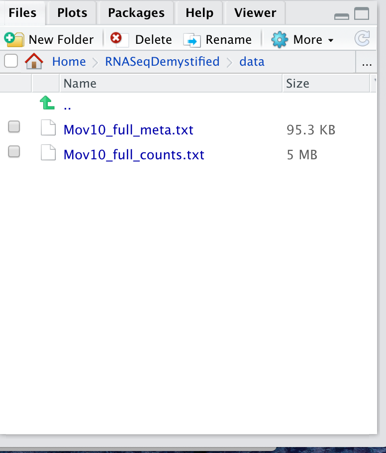

<!--- Allow the page to be wider --->
<style>
    body .main-container {
        max-width: 1200px;
    }
</style>
> # Objectives
> * Shared understanding of R/RStudio environment & packages
> * Import and review count tables
> * Understand how to find help

# Using RStudio

Our goal for any analysis is to do it in a way where it can be easily and exactly replicated, i.e. following standards for "reproducible research". Rstudio has great tools to facilitate this process and is freely available, just like the underlying programming language (R).

First, we'll review the key parts of Rstudio, specifically:
* Console/Terminal (lk)    
* Environments/History/Connections   
* Files/Plots/Packages/Help/Viewer   


## Navigating directories and writing R code

Today we'll be exploring some RNA-seq data that should have been included in the course materials. To open the file for the first module today, we'll want to navigate to the same project directory we used yesterday, which can be done using the file viewer within Rstudio.


## Best practices for file organization

To follow best practices as discussed by [Nobel,2009](https://journals.plos.org/ploscompbiol/article?id=10.1371/journal.pcbi.1000424) for file organization for bioinformatics/computational projects, we will need to make sure there are separate storage locations for:
* Raw data   
* Code    
* Output files   


    

To organize our files for our analysis today we'll create a new folder, ideally in our home directory, using the 'New Folder' button on the right side of our screen. Let's name it "RNASeqDemystified" and then click on the folder in the file viewer. You should now see an empty directory, like below.

            

Then we'll use the 'More' drop down menu on the right side of our file viewer to choose the 'Set as Working Directory' option. You should see a command similar to `setwd("~/RNASeqDemystified")`in your console. 

We'll make a new folder within "RNASeqDemystified" called "data". It is important to make this new folder exactly match by name.


```r
#Example from UCdavis
download.file("https://github.com/umich-brcf-bioinf/rnaseq_demystified_workshop/tree/main/site/Day2Data/Mov10_full_counts.txt", "~/RNASeqDemystified/data/Mov10_full_counts.txt")
download.file("https://github.com/umich-brcf-bioinf/rnaseq_demystified_workshop/tree/main/site/Day2Data/Mov10_full_meta.txt", "~/RNASeqDemystified/data/Mov10_full_meta.txt")
```


<details>
  <summary>Click for alternative download option</summary>
To get our data, we'll need to navigate to [https://github.com/umich-brcf-bioinf/rnaseq_demystified_workshop/blob/main/site/Day2Data/data.zip](https://github.com/umich-brcf-bioinf/rnaseq_demystified_workshop/blob/main/site/Day2Data/data.zip) and click the download button for each file. Use your file viewer to drag & drop the "Mov10_full_counts.txt" and "Mov10_full_meta.txt" files into the 'data' subfolder within the 'RNASeqDemystified' directory.
</details>

**Please use the 'raise hand' button if you are having issues with downloading the data, or if you don't see the files after clicking on the "data" directory, like shown below. If you have successfully downloaded the data then used the green 'yes' button**



# Interacting with the Console

To ensure that we have a record of our commands, it is better to write all commands within our '.R' file and send the command to the console instead of directly entering them.

We'll open a new '.R' script file by using the toolbar at the top of our window. You should see a new panel opening up on the top left. This is where we can write our commands and then send them to the R console, which is now on the bottom left of our Rstudio window.

We'll save our 'Untitled1' file as "RNASeqAnalysis" using the floppy disk iconon the top left of the file window. 

**Ctrl-Enter** is a standard shortcut in Rstudio to send the current line (or selected lines) to the console. If you see an `>`, then R has executed the command. If you see a `+`, this means that the command is not complete and R is waiting (usually for a `)`).

## Key R syntax review

For a more extensive introduction to R syntax, there are many resources available. We drew on [Data Carpentry](https://datacarpentry.org/R-genomics/00-before-we-start.html) for these materials and also recommend the [Software Carpentry](https://swcarpentry.github.io/r-novice-gapminder/) materials for a more extensive introduction to the R programming language.

### Functions

To perform our analysis, we'll need to use functions. These are built in capablities of R or capabilities that have been added to our session with supplementary packages.

Functions have a specific pattern and usually get one or more inputs called **arguments**. If the argument alters the way the function operates, it is often called an **option**. Some functions can take multiple arguements but may have defaults to fall back on if no specific argument or option is given.


```r
print() # does this work?
print("this is an argument")

round(3.14159)
round(3.14159, 2) # how many digits do we get?
```

### Object names & assignments

Objects are strings that act as place holders for any type of data. R has some restrictions for naming objects:
* Cannot start with numbers
* Cannot include dashes
* Cannot have spaces
* Should not be identical to a named function
* Dots & underscores will work but are better to avoid


```r
3 + 7
Mars  <- "planet"
Number <- 3 + 7 # can also use a `=`
Mars <- "red"

## check the values 
Mars
Number
```

Objects maintain their assignment unless reassigned or removed from the session environment.

### Vectors and data types

There are a few different data types that we will be working with when analyzing RNA-seq data. We'll review vectors and what they can store first.


```r
VectorExString <- c("MFG1, MFG2, MFG3")
VectorExNumeric <- c(4, 5, 6)
VectorExLogical <- c(TRUE, FALSE, FALSE)

### Bonus: get an overview of each vector with the function `str()` ###

### How can we convert strings to factors? ###
```


### Reading in count data

The starting point for our differential expression (DE) analysis will be a table of counts, so let's look at the example provided. First, we'll need to read in the file into memory from storage using a function called `read.table`.

```r
CountTable <- read.table("./data/Mov10_full_counts.txt")
head(CountTable) # look at the top of the table
```

```
##            V1         V2         V3         V4         V5         V6         V7
## 1  GeneSymbol Mov10_kd_2 Mov10_kd_3 Mov10_oe_1 Mov10_oe_2 Mov10_oe_3 Irrel_kd_1
## 2 1/2-SBSRNA4         57         41         64         55         38         45
## 3        A1BG         71         40        100         81         41         77
## 4    A1BG-AS1        256        177        220        189        107        213
## 5        A1CF          0          1          1          0          0          0
## 6       A2LD1        146         81        138        125         52         91
##           V8         V9
## 1 Irrel_kd_2 Irrel_kd_3
## 2         31         39
## 3         58         40
## 4        172        126
## 5          0          0
## 6         80         50
```

```r
### How would we get an overview of the structure of the table? ###
```

Now that the file is read into R, we can work with the data and we've created a data frame, which is a standard data structure for tabular data in R.

### Working with data frames

Data frames are a cornerstone of working with data in R and there are some key syntax and functions that will be helpful as we analyze RNA-seq data.

```r
dim(CountTable) # lets us know the number of rows & columns

CountTable[1, ] # lets us look at the first row
head(CountTable[ , 1]) # lets us look at part of the first column

rownames(CountTable) # rownames, if they exist
colnames(CountTable) # colnames, if they exist

### How would you subset the table by rows & columns? ###

### HowShorthand for select a column by name ($ or with string) ###
```

In later sections, we will use additional R syntax, including adding additional columns and merging tables together. 

### Getting help within Rstudio

Rstudio has some built in help resources that are useful when using new functions or packages. To find out more about a function (that is loaded into your session) use the `?` symbol.

```r
?dim
```

# Check package installations 

You should already have DESeq2 and several other libraries installed, so we can load them into our R session now. To do that we'll use the `library` function and send the commands to the console.

Before ending this module, let's load the libraries we'll need to use for the next module. 

```r
library(DESeq2)
library(ggplot2)
library(tidyr)
library(matrixStats)
library('ggrepel', character.only=TRUE)
library('pheatmap', character.only=TRUE)
library('RColorBrewer', character.only=TRUE)
```


---

These materials have been adapted and extended from materials from [Data Carpentry](https://datacarpentry.org/R-genomics/00-before-we-start.html) and [Software Carpentry](https://swcarpentry.github.io/r-novice-gapminder/). These are open access materials distributed under the terms of the [Creative Commons Attribution license (CC BY 4.0)](http://creativecommons.org/licenses/by/4.0/), which permits unrestricted use, distribution, and reproduction in any medium, provided the original author and source are credited.
