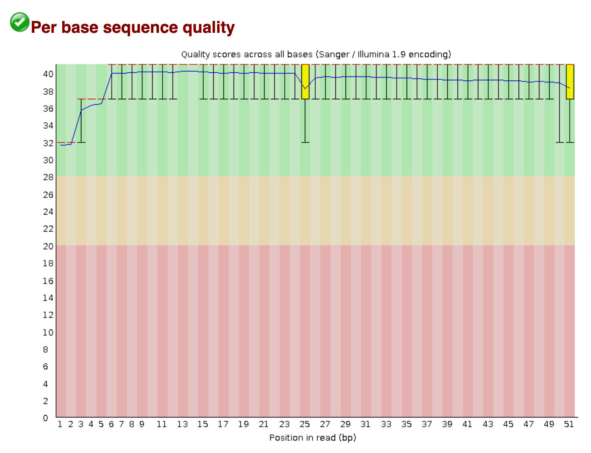

# QC

In this Quality Control (QC) module, we will learn:
* what a FASTQ file is
* how to use FastQC to assess the quality of sequencing reads
* how to interpret FastQC reports
* how to transfer files on a remote server to a personal computer

# Differential Expression Workflow

An overview of the steps of entire differential expression experiment and analysis workflow is shown below. In this lesson, we will go over the bold part of the workflow.

| Step | Task |
| :--: | ---- |
| 1 | Experimental Design |
| 2 | Biological Samples / Library Preparation |
| 3 | Sequence Reads |
| **4** | **Assess Quality of Reads** |
| 5 | Splice-aware Mapping to Genome |
| 6 | Count Reads Associated with Genes |
| :--: | ---- |
| 7 | Organize project files locally |
| 8 | Initialize DESeq2 and fit DESeq2 model |
| 9 | Assess expression variance within treatment groups |
| 10 | Specify pairwise comparisons and test for differential expression |
| 11 | Generate summary figures for comparisons |
| 12 | Annotate differential expression result tables |

# Data Types

Analysis of RNA-seq data requires the use of many types of data. The three most common that we will encounter are:

- Sequence data
- Genome feature data
- Alignment data

We will introduce each data type and their formats in more detail as they enter the workflow, but for now some general notes about the formats we will encounter:

- File formats represent the data in a structured manner.
- Some file formats are not human-readable; they are binary, and we will see what that means when we discuss alignments.
- Many file formats are human readable, but very large. **These files should not be viewed in Word or Excel.**

## FASTQ Files

Raw sequenced reads are stored in [FASTQ](https://en.wikipedia.org/wiki/FASTQ_format) format. This is a plain text, human readable file format that stores information about each read. For a single read there are four lines:

    @A00437:266:HVFMYDSXX:1:1101:1181:1000 1:N:0:AGCCTATC+TGCGTAAC
    TTTATTGTTGATGGTTATTTTTTGTTTATGGTTATTTTGTGTTTATGGTTATTTTTTGTTTATGGTTATTTTTTA
    +
    FFFFFFFFFFFFFFFFFFFFFFFFFFFFFFFFFFFFFFFFFFFFFFFFFFFFFFFFFFFFFFFFFFFFFFFFFFF

| Line | Description |
| :--: | ----------- |
| 1 | Begins with `@` and has information about the read. From AGC will contain flowcell and barcode information. |
| 2 | The DNA sequence. |
| 3 | Always begins with `+` and may contain the same information as line 1. |
| 4 | A string of characters representing the quality scores. Always the same number of characters as line 2. |

### Base Quality Scores

The fourth line encodes the quality of each nucleotide in the read. The most common encoding is referred to as PHRED-33, and the following maps characters to qualities:

    Quality encoding: !"#$%&'()*+,-./0123456789:;<=>?@ABCDEFGHI
                      |         |         |         |         |
       Quality score: 0........10........20........30........40

The above example is a rather boring read with all bases having `F`, meaning a score of 37, which is good. Each quality score represents the probability that the corresponding nucleotide call is incorrect. The quality score is logarithmic and is calculated as:

    Q = -10 x log10(P), where P is the probability that the base call is erroneous

Another way to interpret the scores is in terms of the following table:

| PHRED Quality Score | Probability of incorrect base call | Base call accuracy |
| ------------------- | ---------------------------------- | ------------------ |
| 10 | 1 in 10 | 90% |
| 20 | 1 in 100 | 99% |
| 30 | 1 in 1000 | 99.9% |
| 40 | 1 in 10000 | 99.99% |

It would clearly be painstaking to go through all the base quality scores of all the millions of reads obtained from a sequencing run, so we typically don't evaluate the FASTQ files by sight. Instead, we use tools that take in FASTQ files and summarize the base quality scores (and other characteristics) to determine the overall quality of the reads from the sequencer.

# Quality Assessment with FastQC

The first step in many high-throughput sequencing analyses is to examine the quality of the raw reads with [FastQC](https://www.bioinformatics.babraham.ac.uk/projects/fastqc/). It analyzes various aspects of each FASTQ file and provides a quick impression of the overall quality metrics which are useful to determine before proceeding with downstream analysis. The following modules are present in an easy to read HTML report.

- Read quality score per base (by interpreting the PHRED33 scores)
- Per tile sequencing quality (related to sequencing clusters on the flowcell)
- Read lengths
- GC content
- Adapter content
- Overrepresented sequences

 
 
 
 

## FastQC Exercise

Let's try running FastQC on our FASTQ input files.

1. Make sure logged in to remote aws instance
2. View FastQC help file
3. Prepare to run FastQC
4. Watch FastQC process the files / gather quality metrics
5. View output of FastQC (the filenames)

We can see some HTML reports, but there isn't a way to open them on the remote machine in the command-line interface (CLI). This is a good opportunity to learn how to pull files from a remote server onto our local computer that we're using.

Click here for solution - FastQC exercise

1. Ensure you're on the remote aws instance
2. View FastQC help file

        fastqc --help | less
        # Will need to type `q` to exit from `less`

3. Prepare to run FastQC

        # Make the output directory before running
        mkdir ~/analysis/fastqc
        fastqc -o ~/analysis/fastqc ~/data/reads/*.fastq.gz

4. Watch FastqQC output during processing
5. View output of FastQC

        ls -l analysis/fastqc/

 
 
 
 

## Remote File Transfer Exercise

Transferring Files Exercise:

1. View the manual page of the scp tool
2. Create / execute an scp command on personal computer, to transfer one (or more) of the FastQC reports from the remote system.
    remote ---transfer---> local
3. Ensure that file(s) transferred to personal computer
4. View the FastQC report and interpret

Click here for solution - Remote file transfer exercise

0. Ensure you're on your **local** computer

        # If currently on remote:
        exit

1. View scp manual page

        man scp
        # Will need to type `q` to exit the manual

2. Use scp to transfer a FastQC report to local computer

        scp <username>@50.17.210.255:~/analysis/fastqc/sample_01_R1_fastqc.html ~/workshop_rsd
        # you will need to enter your password to transfer the file

3. Ensure file is on local computer

        ls ~/workshop_rsd/

4. View the FastQC report
Use GUI file manager to find your ~/workshop_rsd folder
Double-click sample_01_R1_fastqc.html (open it with an internet browser)

 
 
 
 

## Interpreting FastQC

FastQC reports are organized around the the different modules characterizing different aspects of the reads. The FastQC [help page](https://www.bioinformatics.babraham.ac.uk/projects/fastqc/Help/) has detailed descriptions for each module.

The report summary is a PASS, WARN, FAIL overview of the modules. It's important to not take them too seriously in all cases as there are a number of assumptions that go into the thresholds that may not apply in your particular experiment.

An important note: For computational reasons, FastQC only evaluates the first 100,000 reads in a FASTQ file. The assumption is that the first 100,000 reads sufficiently represent the full library.

### Per base sequence quality

A per base boxplot of the quality scores with helpful coloring for good, fair, and poor qualities. If a sample has quality scores that degrade at the 3' end of a read (as in the second example below), the sample doesn't necessarily have to be dropped. Some aligners, e.g. STAR, will automatically trim poor quality read ends.

An example of a good quality run.

An example of a poor quality run.

### Sequence Duplication

High sequence duplication, indicated by a skew to the right of the blue curve in the plots below, can be caused by low complexity libraries, too many cycles of PCR amplification, or too little starting material.

On the other hand, if the library was prepared with an enrichment step (e.g. ChIP-seq), then sequence duplication might not be unexpected.

An example of a sample with low sequence duplication levels.

An example of a sample with high sequence duplication levels.

### Overrepresented sequences

Overrepresented sequences are those making up more than 0.1% of the total (of the 100,000 reads sampled). Finding an overrepresented sequence is an indication of something biologically meaningful (e.g. an enrichment step in the library prep process), or it is an issue stemming from the library preparation process (e.g. adapters, a failure to fully remove polyA tails, or contamination).

We see that there is a high number of reads with polyA tails. This could be a result of an inefficient removal of polyA tails.

#### Adapter Content

Adapter sequence typically is not present in standard RNA-seq libraries. However, if the fragment sizes resulting from library prep are smaller than the read length on the sequencer, then it is possible to get "read-through" of the adapter.

This can be dealt with by adding a step to the workflow that trims the reads of adapter content with a tool such as [cutadapt](https://cutadapt.readthedocs.io/en/stable/). We will see this in a later module.

# Acting on QC

## What does good QC mean?

Good QC on raw reads means that RNA quality, library preparation, and sequencing seem fine to proceed with the next steps of analysis. It **does not** mean that you will find differentially expressed genes downstream.

## What does bad QC mean?

The source of bad QC measures are not always easy to determine, and doesn't necessarily mean the data cannot be used downstream. However, bad QC measures may indicate that hazards lie ahead, and that certain steps upstream of sequencing (sample handling, RNA extraction, library preparation) might need to be altered.

---

These materials have been adapted and extended from materials created by the [Harvard Chan Bioinformatics Core (HBC)](http://bioinformatics.sph.harvard.edu/). These are open access materials distributed under the terms of the [Creative Commons Attribution license (CC BY 4.0)](http://creativecommons.org/licenses/by/4.0/), which permits unrestricted use, distribution, and reproduction in any medium, provided the original author and source are credited.
